# Multi Protocol Gateway

**Multi Protocol Gateway (MPG)** is a production-grade data bridge for industrial and energy-monitoring hardware.


[](https://github.com/jBuxtonCalvin/MultiProtocolGateway/blob/main/LICENSE)
[](https://github.com/BuxtonCalvin/MultiProtocolGateway/actions/workflows/codeql.yml)

## 🙏 Credits

This application was inspired by and built upon the excellent work by [@HotNoob](https://github.com/HotNoob/PythonProtocolGateway) and their PythonProtocolGateway project and its precedent project [@andiburger](https://github.com/andiburger/growatt2mqtt). We extend our sincere gratitude for their efforts in solar inverter data management.  MPG diverges from these efforts with Web UI Management, concurrent multi-protocol capability, multiple concurrent bridges, extended hardware device support including coils and discrete registers, and all with completely re-factored data read and write logic that hardens checks against bad data.

## What MPG does

MPG reads live register data from Modbus RTU/TCP, CAN bus, and proprietary serial protocols, then fans that data out to any combination of MQTT brokers, Timescale DB, InfluxDB, and JSON outputs — all managed through a built-in web administration UI.  It is planned to extend hardware reads to include REST apis as well as proprietary protocols that do not rely on serial data.

MPG is purpose-built for solar inverters, battery management systems (BMS), energy meters, and any device that speaks Modbus, but its protocol-map architecture means it can be adapted to virtually any register-based hardware.

---

## Table of Contents

- [Feature Overview](#feature-overview)
- [Web Administration UI](#web-administration-ui)
- [Supported Protocols & Hardware Devices](#supported-protocols--hardware-devices)
- [Transport Architecture](#transport-architecture)
- [Quick Start](#quick-start)
- [Full Docker Compose Stack](#full-docker-compose-stack)
- [Installation as a System Service](#installation-as-a-system-service)
- [Home Assistant Integration](#home-assistant-integration)
- [Protocol Maps & Register Configuration](#protocol-maps--register-configuration)
- [Variable Filtering](#variable-filtering)
- [Configuration Reference](#configuration-reference)
- [Contributing & Donations](#contributing--donations)

---

## Feature Overview

| Capability | Details |
| --- | --- |
| **Input protocols** | Modbus RTU, Modbus TCP, Modbus TLS, Modbus UDP, CAN bus, PACE BMS serial, Pylon serial, EG4 LL-S RS-485 |
| **Output transports** | MQTT, Timescale DB (PostgreSQL hypertable), InfluxDB, JSON file |
| **Web UI** | Full browser-based configuration and live management on port **1717** |
| **Protocol library** | 50+ pre-built device protocol maps; live register analysis tool to build new ones |
| **Config management** | SQLite staging database; changes are previewed and committed — no raw file editing required |
| **Python versions** | 3.10 – 3.14 |
| **Deployment** | Script, systemd service, Docker container, Home Assistant add-on |

---

## Web Administration UI

MPG ships with a **FastAPI + Jinja2 web server** on port **1717**. The server is not a simple settings editor — it is the primary interface for managing the entire gateway lifecycle.

### Dashboard — Device Overview

The index page lists every configured **scraper** (input device) and **bridge** (output transport) in a single panel. Each entry shows its transport class, connection host/port, and real-time connection status. From here you can navigate directly into any device's settings or protocol editor.

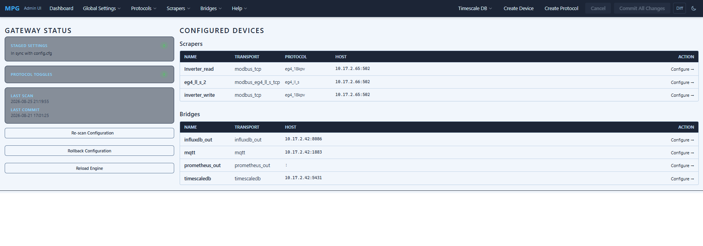

### Device Settings Pane

On the left side of the page, each device gets a dedicated settings pane with a four-column table:

- **(A)ctive** — toggle a checkbox setting in or out of the generated `config.cfg`
- **Key** — the setting key name.
- **Value** — the value that will be written on the next commit; highlighted amber when it differs from the on-disk value
- **Default** — the fallback value from the transport module, shown for reference

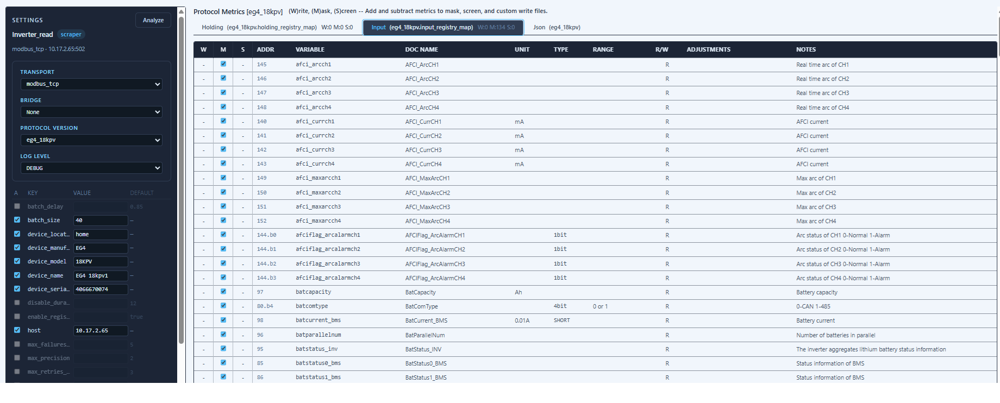

Changes are submitted via HTMX PATCH calls and buffered in a SQLite staging database. Nothing touches `config.cfg` until you explicitly commit.

### Create Device

The create device wizard walks you through creating a scraper device from scratch.

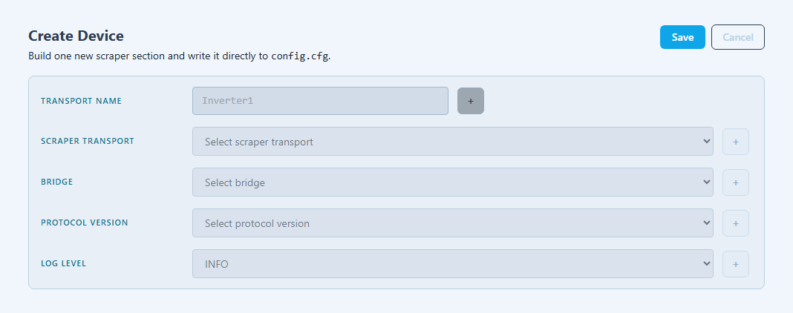

### Protocol Editor

The protocol editor provides a full in-browser spreadsheet-style view of the register map CSV for any protocol. You can:

- Add, edit, or remove register rows inline
- Switch between the **input** (read) and **holding** (read/write) register maps
- View a real-time diff of staged versus on-disk rows before committing
- Manage orphaned rows (registers present in the DB but no longer in the CSV)
- Import and export register maps as CSV or JSON

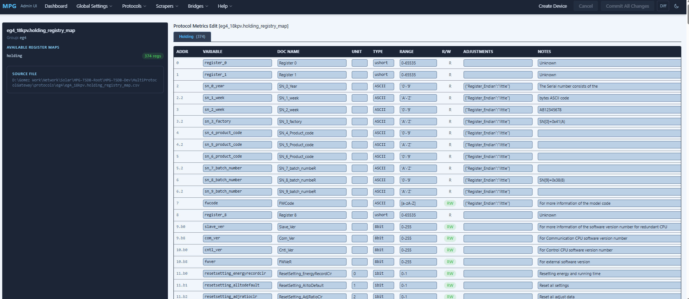

You can also edit the protocol json file.  This file provides default configurations (which can be over-ridden in the config.cfg) and code lookup descriptions which will then populate your output data.

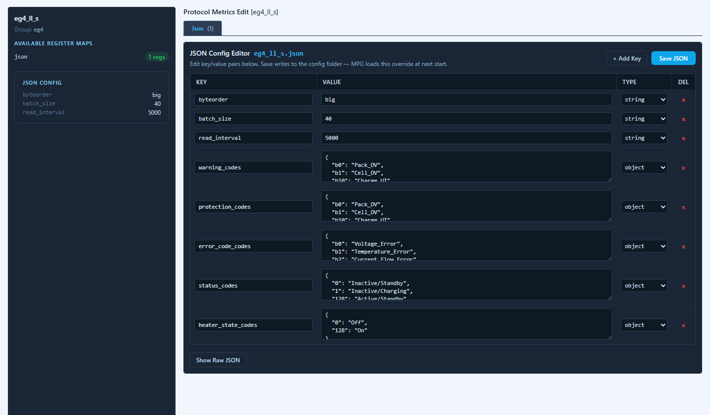

All edits go through a structured diff engine — the UI shows exactly which rows will be added, modified, or removed before anything is written.

### Live Device Analysis

The **Analyze** page is the tool for working with new or undocumented hardware. Select a physical device from the scraper page. Then in the analysis page, and one or more reference protocol maps, then click **Run Analysis**.  MPG then:

1. Performs a live Modbus scan across all input and holding registers in the hardware device
2. Compares the live scan against every selected protocol map
3. Scores each protocol map by accuracy — how many documented registers actually appear in the scan within value ranges set in the protocol
4. Produces per-protocol **Add** and **Remove** action lists, flagging registers that are present in the scan but absent from the default protocol map (candidates to add) and registers in the map that were not found on the device (candidates to remove)

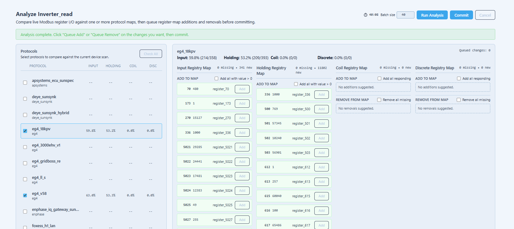

Each suggested change can be individually toggled into or out of the commit queue. When you click **Commit**, MPG writes only the selected changes back to the protocol CSV files and rescans the web database — no manual CSV editing required.

Analysis results stream back to the browser in real time via **Server-Sent Events (SSE)**, so you see scan progress line by line as registers are polled.

### Global & Logging Settings

Separate pages manage gateway-wide settings: Read mode, logging configuration (log level per transport, log rotation), messages. Pages write through the same staging/commit pipeline as device settings.

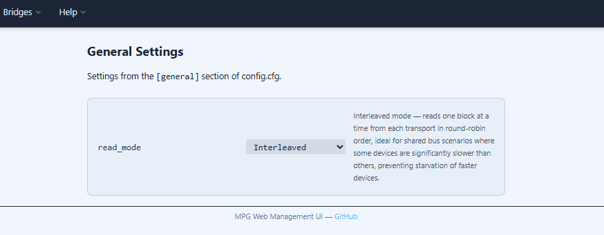

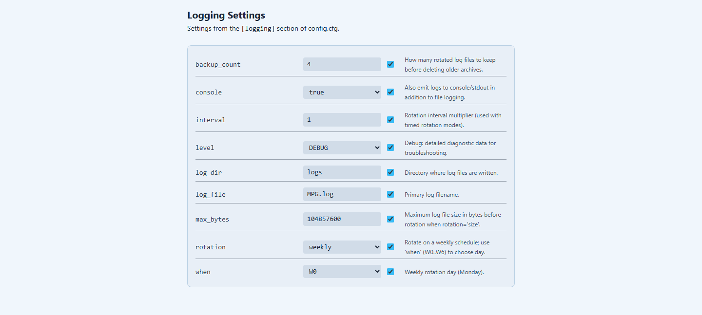

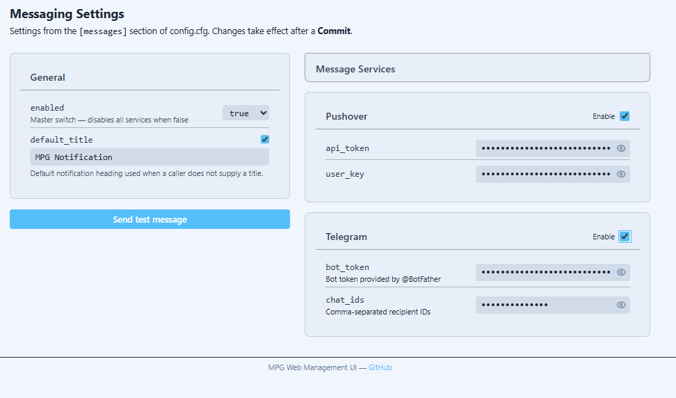

### Log Viewer

A dedicated page streams the live gateway log to the browser, making it easy to watch register reads, MQTT publishes, and error traces without SSH access.

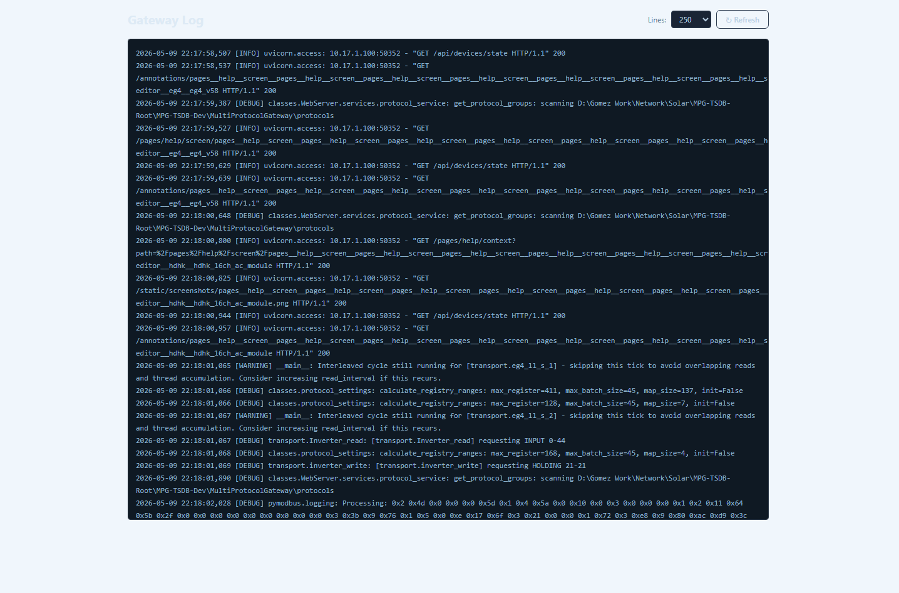

### Transport Library

A reference page listing all available transport classes — scraper types (Modbus variants, CAN bus, serial) and bridge types (MQTT, TimescaleDB, InfluxDB, JSON) — with their configurable parameters.

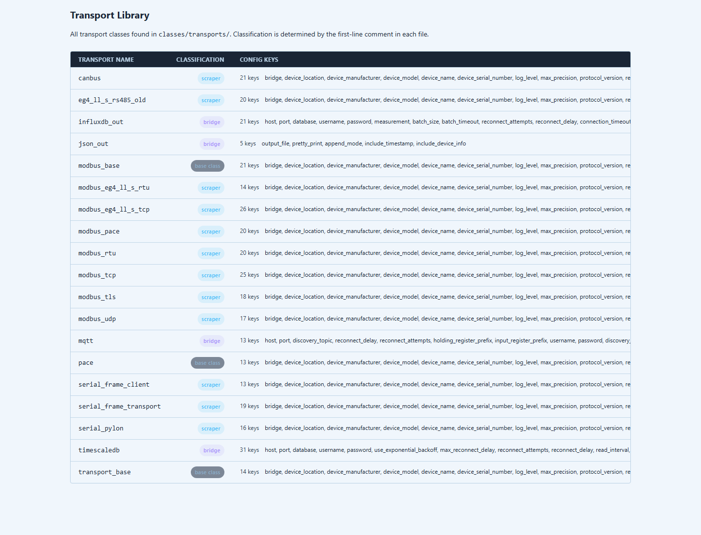

### Settings

A reference page listing all available settings with their definitions.

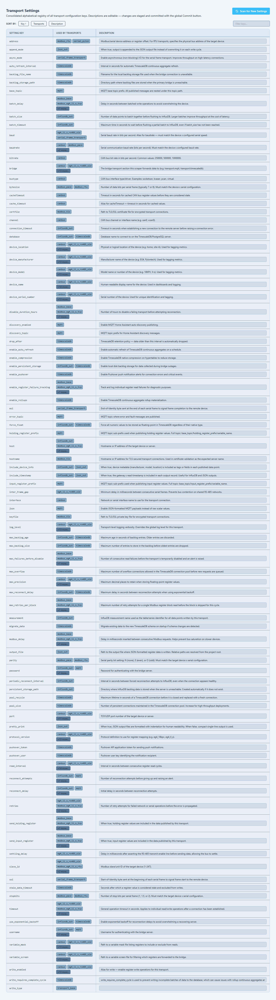

### Bridges

Bridges receive data from scrapers and write it somewhere. They are passive — they do not poll.

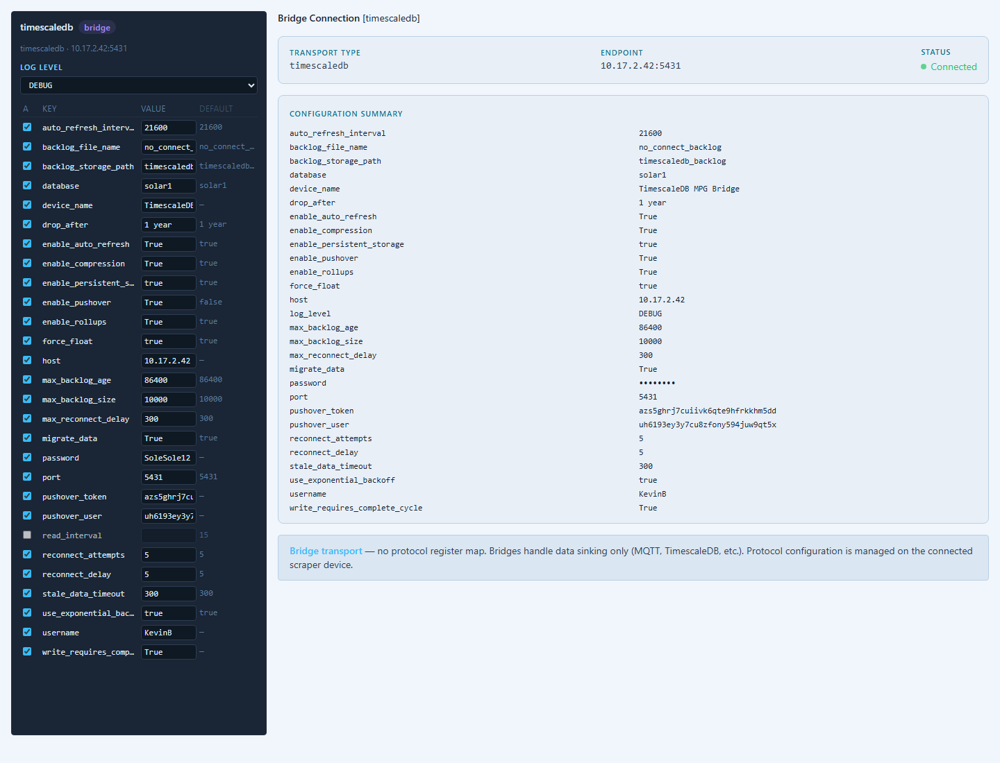

Here are overviews of two database bridges:

- InfluxDB 1.X and 3.x versions [](https://influxdata.com)
  - Advanced Features
    [`influxdb_advanced_features.md`](documentation/bridges/InfluxDB/influxdb_advanced_features.md)

  - Troubleshooting
    [`troubleshooting_influxdb.md`](documentation/bridges/InfluxDB/troubleshooting_influxdb.md)

- TimeScale DB [](https://timescale.com)
  - Readme
    [`Timescale DB`](documentation/bridges/TimeScaleDB/timescaledb_protocol_gateway.md)

Here are the overviews of the MQTT and JSON bridges

- MQTT [](https://mosquitto.org)
  - Readme
    [`MQTT`](documentation/bridges/MQTT/MQTT_bridge.md)

- JSON
  - Readme
    [`JSON`](documentation/bridges/JSON/json_out_example.md)

---

## Supported Protocols & Hardware Devices

MPG ships with pre-built protocol maps for the following manufacturers. Each protocol map is a pair of CSV files (input and holding register maps) plus a JSON descriptor:

| Manufacturer | Models / Protocols | Link |
| --- | --- | --- |
| **Deye Sunsynk** | Deye Sunsynk Inverters (SUN-3K/5K/8K/12K-SG Series Hybrid, Deye Micro SUN Series) | **[`View Deye Sunsynk`](documentation/devices/Deye_Sunsynk.md)** |
| **EG4** | EG4 inverters (v58, 3000EHV, 18kpv, Gridboss, 6000XP, 12000XP, FlexBOSS21), EG4 LL-S (RS-485 & TCP) | **[`View EG4`](documentation/devices/EG4.md)** |
| **Enphase** | Enphase micro inverters (IQ7, IQ7+, IQ8, IQ8Plus, IQ8M, IQ8A Series) | **[`View Enphase`](documentation/devices/Enphase.md)** |
| **Fronius** | Fronius Inverters (Primo, Symo, Galvo, Eco, Gen24 Plus Series) | **[`View Fronius`](documentation/devices/Fronius.md)** |
| **Growatt** | v0.14 (2020+), BMS CAN v1.04, BMS RS-485 (MIN 3000-10000TL-X, SPF 3000-5000TL LVM, SPH, MOD, MAX Series) | **[`View Growatt`](documentation/devices/Growatt.md)** |
| **HDHK** | 16-channel AC module | **[`View HDHK`](documentation/devices/HDHK.md)** |
| **Next Power** | Victor NM RE | **[`View Next Power`](documentation/devices/Next_Power.md)** |
| **PACE BMS** | v1.3 | **[`View PACE BMS`](documentation/devices/PACE.md)** |
| **Pylon** | CAN, RS-485 v3.3 | **[`View Pylon`](documentation/devices/Pylon.md)** |
| **Sigineer** | v0.11 (Sigineer M3000, M6000 Series Inverter/Chargers) | **[`View Sigineer`](documentation/devices/Sigineer.md)** |
| **SMA** | Sunny Island v1, Sunny Boy Tri Power, SMA Modbus (Core1, Sunny Tripower X, Sunny Boy Smart Energy) | **[`View SMA`](documentation/devices/SMA.md)** |
| **SOK** | Sok Inverters (SOK 48V 100Ah / SK48V100 Server VRack Integrated Protocols) | **[`View SOK`](documentation/devices/SOK.md)** |
| **Solar Edge** | Solar Edge Inverters | **[`View Solar Edge`](documentation/devices/SolarEdge.md)** |
| **SolArk** | 8K/12K (v1.1) (Sol-Ark 5K, 8K, 12K, 15K, 30K-3P All-In-One Hybrid) | **[`View SolArk`](documentation/devices/SolArk.md)** |
| **SRNE** | v1.7, v1.96, v3.9 (ASF/ASP Split-Phase, HYP, HESP Hybrid, HF/HFP Series) | **[`View SRNE`](documentation/devices/SRNE.md)** |
| **Sungrow** | Sungrow inverters (SG Series String, SH5.0/6.0/8.0/10RT Hybrid, SG350HX) | **[`View Sungrow`](documentation/devices/Sungrow.md)** |
| **Victron** | GX v3.3, GX Generic CAN, Smartsolar (MultiPlus, MultiPlus-II, Quattro, EasySolar, Phoenix Inverters) | **[`View Victron`](documentation/devices/Victron.md)** |
| **Voltronic** | BMS 2020-03-25, BMS v1.1 (Axpert Max, Axpert King, Infinisolar, VM II/III/IV Series) | **[`View Voltronic`](documentation/devices/Voltronic.md)** |

For a full list of tested devices and community-reported compatibility, see [`devices_and_protocols.csv`](documentation/usage/devices_and_protocols.csv).

MPG also supports any generic Modbus RTU or TCP device when given a register map — the Live Analysis tool is specifically designed to help build maps for undocumented hardware.

---

## Transport Architecture

MPG separates **scrapers** (devices it reads from) and **bridges** (destinations it writes to). A single gateway instance can run multiple scrapers and multiple bridges simultaneously.

``` text
Hardware Device
      │  (Modbus RTU / TCP / CAN / Serial)
      ▼
 ┌─────────────┐
 │  Scraper    │  modbus_tcp · modbus_rtu · modbus_tls · canbus · pace · pylon · eg4_ll_s
 └──────┬──────┘
        │  parsed register values
        ▼
 ┌─────────────┐
 │   Bridge    │  mqtt · timescaledb · influxdb_out · json_out
 └─────────────┘
```

Each transport is independently configurable with its own scan interval, log level, variable mask, and protocol version. A scraper and bridge sharing the same `device_name` are linked — the scraper reads data, the bridge publishes it.

---

## Quick Start

### Recommendation

- It is much easier and far less error prone to install MPG with its associated bridges via docker compose.  A full docker stack is available see [`docker-compose.yml`](documentation/docker/docker-compose.yml).  Remove those applications that you do not want to use from the compose file. Make sure to also install the accompanying configuration files .env, mosquitto.conf and MPG.yaml (Grafana provisioning).  However, if you want to install without Docker, please read the following:

### Prerequisites

- Python 3.10 or later
- A device connected via USB serial adapter, RS-485 adapter, or network

### Install

From source:

```bash
git clone https://github.com/BuxtonCalvin/MultiProtocolGateway.git
cd MultiProtocolGateway
pip install -r requirements.txt
```

### Configure

```bash
cp config.example.cfg config.cfg
nano config.cfg
```

Or skip the file — open the web UI at `http://localhost:1717` after starting and configure everything there.

### Run

```bash
python3 -u protocol_gateway.py
# or with a specific config file:
python3 -u protocol_gateway.py config.cfg
```

The web management UI will be available at **`http://localhost:1717`**.

### Docker (single container)

```bash
# Build locally
docker build . -t protocol_gateway
docker run --device=/dev/ttyUSB0 -p 1717:1717 protocol_gateway

# Or pull from Docker Hub
docker pull buxtoncalvin/multiprotocolgateway
docker run \
  -v $(pwd)/config.cfg:/app/config.cfg \
  -p 1717:1717 \
  buxtoncalvin/multiprotocolgateway
```

[Docker Hub Repository](https://hub.docker.com/r/buxtoncalvin/multiprotocolgateway)

---

## Full Docker Compose Stack

For a complete monitoring stack — MPG + Timescale DB + InfluxDB + MQTT + pgAdmin + Chronograf + Grafana — see the included [`docker-compose.yml`](documentation/docker/docker-compose.yml) in this repository.

The stack provides:

| Service | Port | Purpose |
| --- | --- | --- |
| **MPG** | 1717 | Gateway web UI and core service |
| **Timescale DB** | 5432 | Time-series PostgreSQL for long-term storage |
| **InfluxDB** | 8086 | Alternative time-series database |
| **Mosquitto MQTT** | 1883 / 9001 | MQTT broker for Home Assistant and other subscribers |
| **pgAdmin** | 5050 | PostgreSQL/Timescale DB web management UI |
| **Chronograf** | 8888 | InfluxDB web dashboard |
| **Grafana** | 3000 | Unified visualization for all data sources |

Start the full stack:

```bash
cp .env.example .env
# Edit .env to set passwords and data paths
docker compose up -d
```

Full documentation for the compose stack is in [`docker-compose.yml`](documentation/docker/docker-compose.yml).

---

## Installation as a System Service

MPG can run as a systemd service that starts automatically on boot.

```bash
cp protocol_gateway.example.service /etc/systemd/system/protocol_gateway.service
nano /etc/systemd/system/protocol_gateway.service   # set WorkingDirectory to your install path

sudo systemctl daemon-reload
sudo systemctl enable protocol_gateway.service
sudo systemctl start protocol_gateway.service
systemctl status protocol_gateway.service
```

The short alias `mpg` can be used as the service name if preferred.

---

## Home Assistant Integration

MPG publishes data to MQTT using Home Assistant's auto-discovery format. Devices appear automatically under **Settings → Devices & Services → MQTT** once the broker is configured on both sides.

### Install Mosquitto on Home Assistant (if not installed via docker)

``` txt
Settings → Add-Ons → Add-On Store → Mosquitto broker
```

Create an MQTT user:

``` txt
Settings → People → Users → Add User → Can only log in from the local network
```

For connecting an external MQTT broker to Home Assistant, see [this guide](https://www.youtube.com/watch?v=sP2gYLYQat8).

### Troubleshooting: Unknown Status

If all MQTT values appear as "Unknown" immediately after setup, this is a known Home Assistant discovery timing issue. Restart the MPG service and the values will populate correctly.

---

## Protocol Maps & Register Configuration

Each supported device has a protocol directory under `protocols/` containing:

- **`<name>.json`** — device metadata: transport type, default settings, lookup descriptions for codes
- **`<name>.holding_registry_map.csv`** — read/write (holding) Modbus registers
  **additional optional registers**  - per manufacturer device properties
- **`<name>.input_registry_map.csv`** — read-only (input) Modbus registers
- **`<name>.coil_registry_map.csv`** — read/write (coil) Modbus registers
- **`<name>.discrete_registry_map.csv`** — read-only (discrete) Modbus registers

The CSV files use `,` as delimiter (OpenOffice/LibreOffice compatible) and support the following columns:

| Column | Description |
| --- | --- |
| `register` | Modbus register number |
| `variable_name` | Friendly name used in MQTT topics and DB columns |
| `documented_name` | Original name from the device manual |
| `data_type` | e.g. `int16`, `uint16`, `float32`, `bit` |
| `unit` | e.g. `V`, `A`, `W`, `°C`, 1 , .01 , 10 etc. |
| `values` | Valid range or enumeration |
| `read_interval` | Override the global poll interval for this register |
| `writable` | `R` (read-only) or `RW` (writable) |
| `adjustments` | JSON encoded code to enable special register handling |
| `note` | Free-form note shown in the web UI |

Variable names have been normalized for readability. To use original documented names, clear the `variable_name` column in the CSV or edit via the Protocol Editor in the web UI.

Find more protocol documentation here:  [`protocols.md`](documentation/usage/protocols.md)

### Using the Live Analysis Tool to Build New Maps

1. Connect your device and confirm it appears in the MPG dashboard
2. Navigate to **Analyze → [Device Name]**
3. Select one or more reference protocol maps to compare against
4. Click **Run Analysis** and wait for the scan to complete
5. Review the scored results — higher accuracy means a closer protocol match
6. Toggle individual register additions and removals into the commit queue
7. Click **Commit** to write the changes to the protocol CSV files

---

## Variable Filtering

### Allowlist (`variable_mask_{transport_name}.txt`)

To publish only a specific set of variables, list them one per line. An empty file means all variables are published.
Each scraper has its own mask file.

``` ini
battery_voltage
battery_soc
grid_power
```

### Blocklist (`variable_screen_{transport_name}.txt`)

To exclude specific variables from all outputs:
Each scraper has its own screen file.

``` ini
internal_temperature_raw
debug_register_42
```

---

## Configuration Reference

The primary configuration is `config.cfg` (INI format). Each `[section]` represents one transport instance. The web UI manages this file — direct editing is supported but the UI's staging/commit workflow is recommended to avoid syntax errors.

Key settings available on every transport:

| Key | Default | Description |
| --- | --- | --- |
| `device_name` | | Unique identifier linking scraper and bridge |
| `protocol_version` | | Protocol map to load (e.g. `growatt_v0.14`) |
| `batch_size` | `40` | Number of registers to batch read per a given poll |
| `read_interval` | `15` | Seconds between register polls |
| `bridge` | | Output transport section name |
| `log_level` | `INFO` | Per-transport log verbosity |
| `max_precision` | `2` | Decimal places for float values |
| `write_enabled` | `false` | Enable Modbus write operations |
| `variable_mask` | | Path to allowlist file |
| `variable_screen` | | Path to blocklist file |

For Modbus transports, additional keys include `host`, `port`, `unit_id`,  `max_retries_per_block`, and `disable_duration_hours`.

Full configuration documentation: [`transports.md`](documentation/usage/transports.md) and for full settings available:

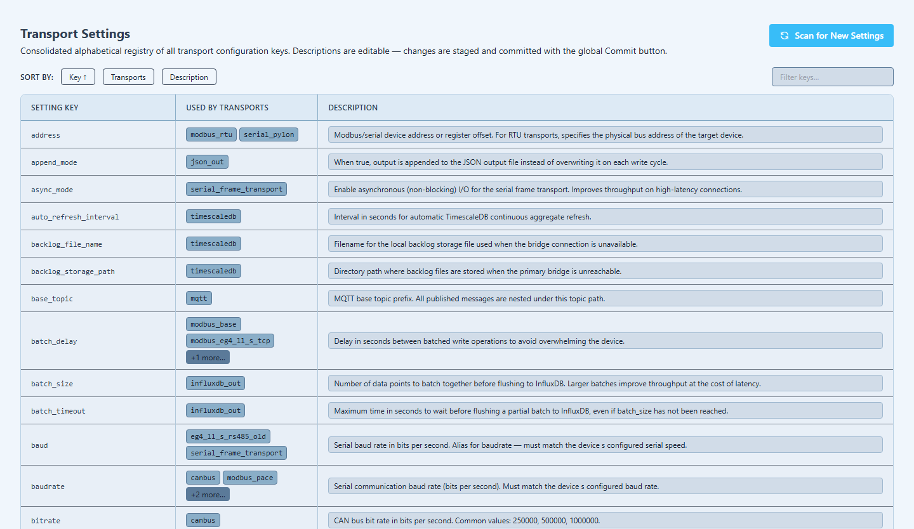

For manufacturer device-specific wiring and installation guides: [devices](documentation/devices)

---

## Contributing & Donations

MPG was built because no working open-source solution existed that could poll disparate devices at the same time, and then send that disparate data to disparate outputs. Community protocol maps, bug reports, and pull requests are welcome.

If MPG has saved you time or money, donations and GitHub sponsorships are appreciated and help fund continued development.

[GitHub Sponsors](https://github.com/sponsors/BuxtonCalvin)
