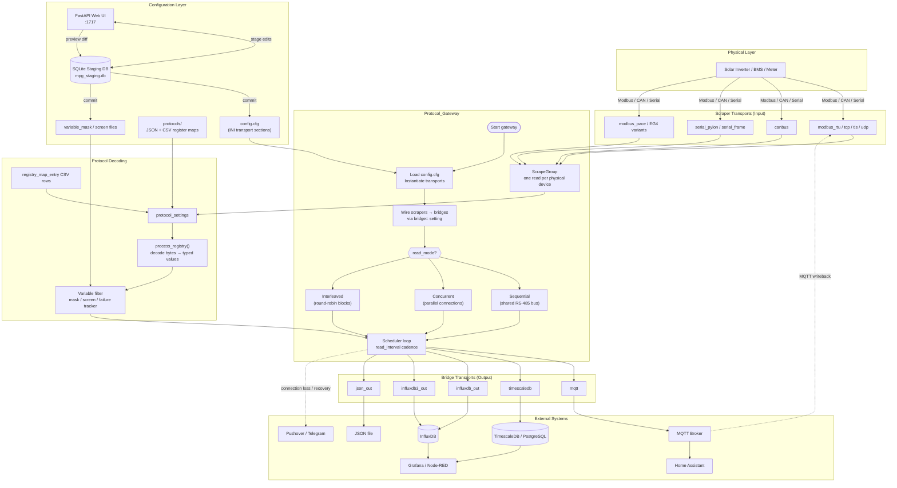
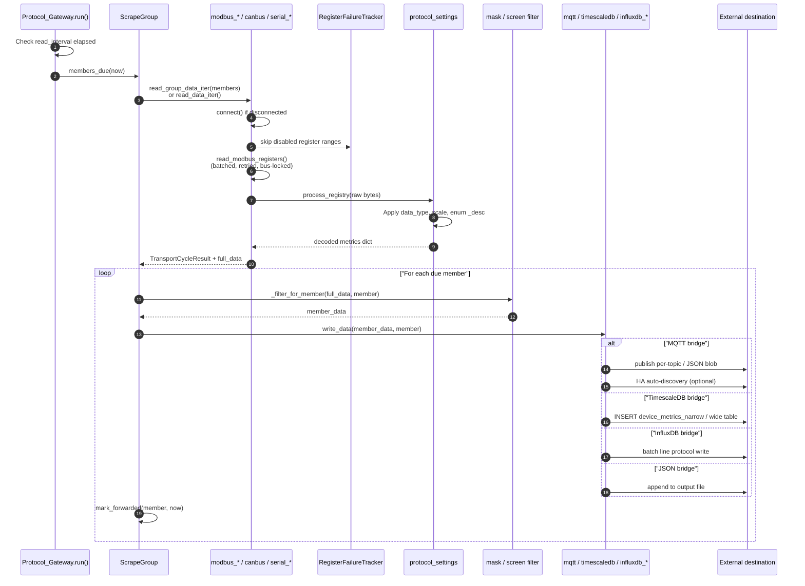
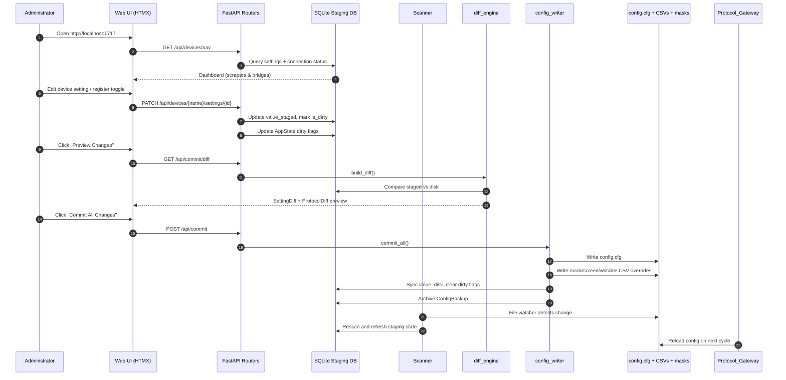
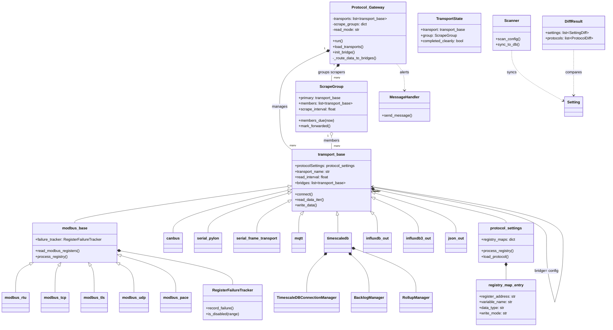
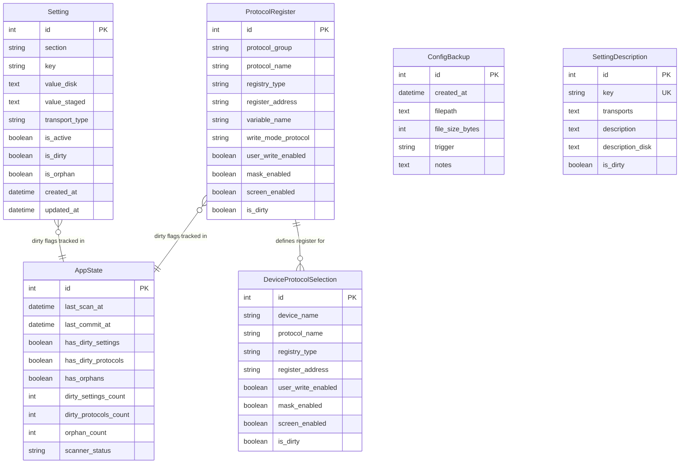
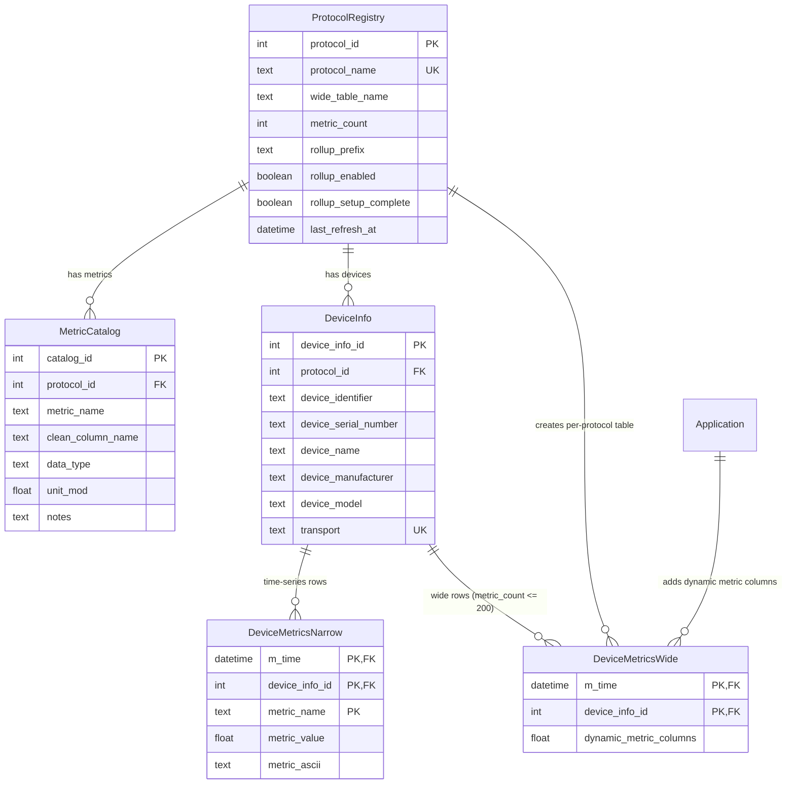
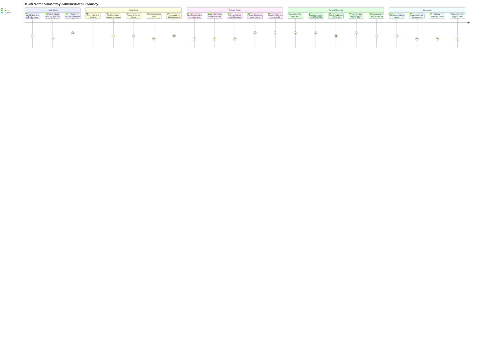

# MultiProtocolGateway — Architecture Diagrams

Mermaid diagrams for the Multi Protocol Gateway (MPG) data bridge. MPG reads solar/energy hardware over Modbus, CAN, and serial protocols, decodes register maps, and forwards telemetry to MQTT, TimescaleDB, InfluxDB, and JSON outputs. Configuration is managed through a FastAPI web UI on port 1717.

---

## 1. Flowchart — System Data & Configuration Flow

---

## 2. Sequence Diagram — Scrape Cycle & Bridge Output

### Sequence Diagram — Web UI Configuration Commit

---

## 3. Class Diagram — Core Classes & Relationships

---

## 4. Entity Relationship (ER) Diagram

### SQLite Staging Database (`mpg_staging.db`)

Used by the Web UI to stage configuration edits before committing to disk. Not used for telemetry storage.

### TimescaleDB Telemetry Schema (created by `timescaledb` bridge)

---

## 5. User Journey — MPG Administrator

---

## Related Documentation

- [README](../../README.md) — project overview and quick start
- [Transports](../usage/transports.md) — scraper and bridge configuration
- [Protocols](../usage/protocols.md) — register map editing
- [TimescaleDB Bridge](../bridges/TimeScaleDB/timescaledb.md) — telemetry schema and queries
- [MQTT Bridge](../bridges/MQTT/MQTT_bridge.md) — publish topics and writeback
