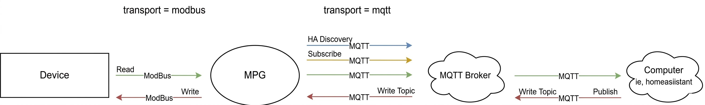
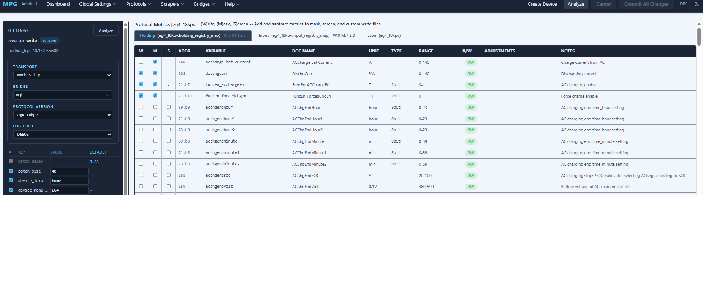

# MQTT Module for Multi Protocol Gateway

---

## Overview

The MQTT module is a **bridge transport** for the Multi Protocol Gateway, and unlike most bridges it works in **both directions**:

- Receives telemetry data from an upstream scraper transport (e.g. a Modbus TCP connected inverter) and **publishes** it to an MQTT broker
- **Subscribes** to a small, deliberately-gated set of per-variable topics so a value published back to the broker can be written to a Modbus holding or coil register
- Publishes a retained **availability** topic so downstream consumers (Home Assistant, dashboards, automations) know whether the underlying device is actively reporting
- Optionally publishes **Home Assistant MQTT Discovery** payloads so every metric shows up in HA as the right kind of entity (sensor, binary sensor, number, select or switch) with units, device classes and availability, with no manual HA configuration

The module does **not** scrape data itself and does **not** decide on its own what's writable — it publishes whatever the gateway hands it, and accepts write commands only for variables that satisfy two independent gates (see [The Two-Gate Write Model](#the-two-gate-write-model) below).

---

## Architecture Overview

```text
                [ Inverter / Device ]
                         |
                         v
              [ Modbus / TCP Transport ]
                         |
              (telemetry)|(write commands)
                         v         ^
                  [ Protocol Gateway ]
                         |         ^
                         v         |
                  [ MQTT Transport ]
                         |         ^
                         v         |
                  [ MQTT Broker ]
                    |    |    |
                    v    v    v
              [Home Assistant] [Dashboards] [Automations / scripts]
```

Telemetry flows down the left side every scrape cycle. Write commands flow up the right side only for the specific topics this module chose to subscribe to at startup — nothing is accepted on a wildcard basis.



---

## What the MQTT Module Does

### Core Responsibilities

- Publishes every metric a bridged scraper transport produces, either as one flat topic per metric or as a single JSON blob per device
- Publishes two distinct availability signals: an LWT-backed bridge-connectivity topic, and a per-device data-freshness topic
- Maintains a background, exponential-backoff reconnect loop independent of paho's own reconnect handling
- Subscribes to a per-variable write topic for every metric that is both protocol-writable *and* user-write-enabled, and routes incoming messages on those topics back into the gateway's write path
- Reports write-command processing failures to a dedicated error topic
- Re-subscribes all write topics automatically after a broker reconnect
- Optionally publishes Home Assistant MQTT Discovery config payloads, including controls for registers that have passed both write gates, and re-announces them (plus the last known values) whenever Home Assistant restarts

### Telemetry Publishing

Controlled by the `json` setting:

- **`json = false`** (default) — one topic per metric, flat and lowercased:

  ```text
  inverter_write/4066670074/soc         → 84
  inverter_write/4066670074/vpv1        → 0.1
  inverter_write/4066670074/dischgcurr  → 16
  ```

- **`json = true`** — a single JSON object per device, published once per cycle:

  ```json
  {"soc": 84, "vpv1": 0.1, "dischgcurr": 16}
  ```

Floating point values are rounded to `max_precision` decimal places (a general transport setting) before publishing when `json = false`.

### Availability

Two independent signals answer two different questions, keeping them distinct:

**Bridge connectivity** — `{base_topic}/bridge_status` (`"online"` / `"offline"`) answers *"is this MQTT bridge's connection to the broker currently up?"* It is backed by a real MQTT Last Will and Testament, set once at client construction time (`qos=1, retain=True`), so an ungraceful crash — killed process, power loss, segfault — is reflected automatically by the broker itself with no reliance on this application getting a chance to run any shutdown code. `on_connect` publishes `"online"` to it on every successful connection; `exit_handler` publishes `"offline"` to it on a clean shutdown as an immediate signal (a clean disconnect does not itself trigger the LWT — brokers only fire the Will on an *unexpected* disconnect or keepalive timeout).

**Per-device data freshness** — `{base_topic}/{device_identifier}/availability` (`"online"` / `"offline"`) answers a different question: *"is telemetry for this specific device actually flowing?"* This one is republished on every scrape cycle rather than LWT-backed, for two reasons: a single MQTT client can only have one Last Will (so it structurally can't cover multiple bridged devices individually), and more importantly, a Last Will only fires on *connection* loss — it says nothing about the underlying Modbus device going silent while the MQTT connection itself stays healthy. `exit_handler` marks every device this bridge has actually published telemetry for (tracked automatically) as `"offline"` on clean shutdown.

**In Home Assistant**, discovered entities list *both* topics as availability sources and are only available while both read `online` (`availability_mode: all`). A crashed or killed gateway therefore turns every entity `unavailable` via the LWT, instead of leaving the last value looking current.

### Reconnect Handling

`on_disconnect` spawns a background daemon thread (`_reconnect_loop`) that retries `client.reconnect()` with exponential backoff (`reconnect_delay * 2^attempt`, capped at 10 minutes, jittered) up to `reconnect_attempts` times (0 = unlimited). This is independent of anything paho does automatically, and only one reconnect thread ever runs at a time per transport instance. On success, `on_connect` fires and re-subscribes every previously-registered write topic — see [Write Topics](#write-topics) below.

---

## Topic Structure

### Telemetry Topics

```text
{base_topic}/{device_identifier}/{variable_name}
```

Lowercased, one per metric, published every scrape cycle (or one JSON blob at the same path when `json = true`).

**Optional per-registry-type prefix:** if `holding_register_prefix`, `input_register_prefix`, `coil_register_prefix`, or `discrete_register_prefix` is set, telemetry for a metric backed by that registry type is published one segment deeper instead:

```text
{base_topic}/{device_identifier}/{prefix}/{variable_name}
```

All four default to empty, which reproduces the flat topic shape above exactly — this is purely opt-in, useful mainly for separating boolean coil/discrete values from numeric holding/input values in the topic tree (e.g. for a dashboard or Home Assistant grouping convention that expects `binary_sensor`-like values under their own prefix). The prefix used for a given metric is resolved from the protocol's registry map at `init_bridge` time, not guessed from the value's Python type.

### Availability Topics

```text
{base_topic}/bridge_status                         →  bridge-level connectivity, LWT-backed
{base_topic}/{device_identifier}/availability       →  per-device data freshness
```

See [Availability](#availability) above for why these are two separate signals rather than one.

### Write Topics

```text
{base_topic}/{device_identifier}/{variable_name}/write
```

or, when a registry-type prefix is configured for that variable's registry type (see [Telemetry Topics](#telemetry-topics) above):

**Example:** to trigger `quick_charge_start_enable` on device `4066670074`, publish `1` to:

```text
inverter_write/4066670074/quick_charge_start_enable/write
```

With `holding_register_prefix = holding` configured, the same command instead goes to:

```text
inverter_write/4066670074/holding/quick_charge_start_enable/write
```

Only metrics that pass both gates below get a write topic subscribed at all — publishing to an unsubscribed topic is accepted by the broker but never reaches this module.

---

## The Two-Gate Write Model

A metric is only writable over MQTT if **both** of the following are true. Neither one alone is sufficient.

### Gate 1 — Protocol-level hardware capability (`write_mode`)

Defined in the protocol's registry CSV (e.g. `eg4_18kpv.holding_registry_map.csv`), immutable at runtime, and shared by every device using that protocol. A register is only a write candidate if its `write_mode` resolves to `WRITE` or `WRITEONLY` — this reflects what the hardware itself actually supports, per the manufacturer's register map, and the admin UI's R/W column reflects this value directly.

### Gate 2 — User write-enable selection (per device)

Even if a register is hardware-capable of being written, nothing gets a write topic until a user explicitly enables it for **that specific device** via the "W" checkbox in the admin UI. This is intentionally scoped per-device rather than per-protocol: two inverters running the identical protocol can have different write selections — e.g. only one of a pair of otherwise-identical units is actually wired up for remote control.

![Write]

This selection is committed to a per-device allowlist file:

```text
config/<device_name>.writable.csv
```

where `<device_name>` is the transport's config section name (e.g. `inverter_write`, not the human-readable `device_name` config key). This file is regenerated by the gateway's commit flow whenever write selections change, and is read back by both the scanner (on re-scan) and this MQTT module (at startup, in `init_bridge`).

### Startup Requirement

`init_bridge` — the method that builds `self._write_topics` from the allowlist and actually subscribes each topic — runs **once**, at gateway startup. It is not re-run on a broker reconnect; reconnects only re-subscribe whatever was already built at startup. **After committing a change to write selections, the gateway process must be fully restarted** for the new topic(s) to actually be subscribed — a config commit alone is not enough.

### Diagnosing a Missing Write Topic

If a metric that should be writable doesn't respond to a publish, check the log at startup for one of:

- `"No writable allowlist found for '<device>'..."` — the writable CSV doesn't exist yet for this device; commit write selections and restart.
- `"'<device>': N variable(s) are protocol-writable but excluded from MQTT write topics because they're missing from the writable CSV allowlist..."` — names the specific variables that failed Gate 2 despite passing Gate 1.

### Tracing a Write Command End-to-End

Every stage of a write command's journey is now tagged with the same `variable_name`, so a single `grep` for that name against the log shows the complete story in order:

1. **`"MQTT MSG: <topic> <payload>"`** — logged unconditionally for *every* message this client receives, before any topic matching happens. If this line never appears for your topic, the message never reached this client at all (broker accepted the publish, but nothing here was subscribed to it) — almost always a stale/missing allowlist file, a process that hasn't been restarted since the file was created, or a topic built without the registry-type prefix your config actually requires (see [Write Topics](#write-topics) above).
2. **`"Write command received: variable='<name>' topic='<topic>' payload='<payload>'"`** — confirms the topic matched a subscribed write topic and the command was handed off into the gateway's write path. If step 1 appears but this doesn't, the topic string wasn't found in `self._write_topics` — check for a trailing slash, casing, or (again) a missing/extra prefix segment.
3. **`"WRITE: <old> => <new> ( <old_raw> => <new_raw> ) to Register <n>"`** (from `modbus_base.write_variable`) — confirms the value was decoded and a Modbus write was about to be dispatched. This one only reflects *intent*; it fires before the actual wire call.
4. **`"write_registers to register <n> ('<name>') confirmed by device"`** or a matching failure line (from `modbus_base._check_write_response`) — the actual, authoritative answer to "did the inverter acknowledge this." Logged at INFO for a confirmed write, at ERROR for anything the device rejected (illegal address, illegal value, etc.) or that never got a response at all. If step 3 appears but this doesn't follow at all, the write call itself raised an exception before ever reaching the device — check the ERROR line just above it for the exception message.

---

## Error Reporting

`error_topic` (default `error`, combined as `{base_topic}/{error_topic}`) publishes a structured JSON error report whenever an incoming write command fails to process — a malformed payload, a type coercion failure, or any other exception raised while routing the message back into the gateway's write path:

```json
{
  "timestamp": "2026-07-08T14:22:03.512931+00:00",
  "context": "write_command",
  "message": "Failed to process write on 'inverter_write/4066670074/quick_charge_start_enable/write': ..."
}
```

This is deliberately narrow in scope: it only reports errors this module itself can detect *while connected* (a write command it received but couldn't process). It cannot report reconnect exhaustion or broker-connection failures, since by definition there's no connection to publish an error over in that case — those remain log-only, and are what `bridge_status`'s LWT is for instead. The publish is best-effort and will never itself raise or block message processing.

---

## Home Assistant Discovery

Enabled via `discovery_enabled = true`. When active, `mqtt_discovery()` runs at the end of `init_bridge` and publishes one retained MQTT Discovery config per registry entry (every entry except those with `write_mode = READDISABLED`) to:

```text
{discovery_topic}/{platform}/HN-{device_serial_number}/{variable_name}/config
```

### Which Home Assistant entity does a register become?

With `discovery_entity_types = auto` (the default) each entry is published as the most appropriate platform:

| Register | Home Assistant entity |
| --- | --- |
| Read-only numeric value | `sensor`, with unit, `device_class` and `state_class` where they can be inferred safely |
| Read-only text, enum-mapped or flag value | `sensor` with no unit or state class |
| Read-only coil or discrete input | `binary_sensor` (`1`/`0`, `True`/`False` and `on`/`off` are all understood) |
| Writable numeric register that passed both write gates | `number`, with min/max/step from the protocol |
| Writable enum-mapped register that passed both write gates | `select`, options are the value labels |
| Writable coil (or single-bit field) that passed both write gates | `switch`, sending `1` / `0` |

Controls are only created for registers that passed **both** gates described in [The Two-Gate Write Model](#the-two-gate-write-model). A register that is merely protocol-writable but not enabled for this device stays a read-only sensor, so discovery never advertises a control that a write would be rejected for. Each control's `command_topic` is exactly the `/write` topic subscribed in `init_bridge`, so everything in [Tracing a Write Command End-to-End](#tracing-a-write-command-end-to-end) applies unchanged.

Because the allowlist is read at startup, **enabling or disabling a register for writing requires a restart** before the matching control appears or disappears, just as for the write topic itself.

Setting `discovery_entity_types = sensor` restores the earlier behaviour: every entry is a read-only sensor and no `command_topic` is published. Switching between the two settings clears the retained configs of the platform no longer used, so Home Assistant does not keep duplicate or orphaned entities.

### Units, device classes and state classes

Units are normalised before publishing (`kWH`, `k Wh` and `kwh` all become `kWh`; `C` and the mis-encoded `°C` become `°C`). For a numeric register whose unit is one of the following, MPG also sets the device class and state class, which is what makes the entity usable in the Energy dashboard and long-term statistics:

| Unit | Device class | State class |
| --- | --- | --- |
| `V`, `mV` | `voltage` | `measurement` |
| `A`, `mA` | `current` | `measurement` |
| `W`, `kW` | `power` | `measurement` |
| `VA` / `var` | `apparent_power` / `reactive_power` | `measurement` |
| `Wh`, `kWh`, `MWh` | `energy` | `total_increasing` |
| `Hz` | `frequency` | `measurement` |
| `°C` | `temperature` | `measurement` |
| `ms`, `s`, `min`, `h` | `duration` | none |
| `%`, `Ah`, `mAh`, `kvar` | none | `measurement` |

This table is deliberately conservative: Home Assistant refuses to create an entity whose unit is not valid for its device class, so a class is never guessed. For anything else, set it yourself in the protocol CSV with the optional `ha device class`, `ha state class` and `ha entity category` columns (for example `battery` on a `%` state-of-charge register). See [Home Assistant Columns](../../usage/protocols.md#home-assistant-columns). Text and enum-mapped values never receive a unit or state class.

### Availability

Every entity lists the per-device `availability` topic and the LWT-backed `bridge_status` topic (see [Availability](#availability)) and is available only while both are `online`.

Set `discovery_expire_after` (seconds) to additionally mark sensors and binary sensors `unavailable` if no value arrives for that long. It is off by default because it assumes every register is published each cycle; registers with a long `read interval` would otherwise flap to `unavailable`.

### When Home Assistant restarts

Discovery configs are retained, so they survive a restart, but telemetry is not retained, so entities would otherwise show `unknown` until each metric is next published. MPG therefore subscribes to `{discovery_topic}/status` (Home Assistant's birth message). When Home Assistant announces `online`, MPG re-publishes discovery for every device, then replays the last known value of every metric. Repeated announcements within a few seconds are ignored. Registers that have never been read, such as ones with a long `read interval`, still show `unknown` until their first read.

### JSON mode

With `json = true` there are no per-metric topics, so entities share the per-device JSON topic and extract their own key with a `value_template` (for example `{{ value_json['soc'] }}`). Discovery works in either mode.

### Entity names and IDs

Entity display names are made readable (`grid_charge_enable` becomes "Grid charge enable"). The `unique_id` (`MPG_<serial>_<variable_name>`), the device identifier and the `HN-` discovery topic segment are **intentionally unchanged**. Home Assistant ties entities, history and dashboards to these values, so changing them would orphan every existing entity. Keep them if you rename or fork the application.

### Upgrading from sensor-only discovery

Existing sensors keep their `unique_id` and history, but Home Assistant creates a *new* entity ID when an entry changes platform:

- A register you have enabled for writing changes from `sensor.<name>` to `number.<name>`, `select.<name>` or `switch.<name>`.
- A coil or discrete input changes from `sensor.<name>` to `binary_sensor.<name>`.

The old sensor is removed, so automations, dashboards and history that referenced it need updating. To avoid any change, set `discovery_entity_types = sensor`. Entries with `write_mode = WRITEONLY` have no readable value; as a sensor they are seeded with the literal state `"WRITEONLY"` (the previous behaviour). In `auto` mode they become optimistic controls if write-enabled, and are not published at all otherwise.

---

## Configuration Reference

```ini
[transport.mqtt]
transport = mqtt
host = 10.17.2.42
port = 1883
base_topic = inverter_write
username = your-username
password = your-password

# Optional — defaults shown
error_topic = error
discovery_enabled = false
discovery_topic = homeassistant
# auto = native HA sensor/binary_sensor/number/select/switch entities;
# sensor = every register is a read-only sensor (previous behaviour)
discovery_entity_types = auto
# seconds; mark HA sensors unavailable after this long without a value (0 = off)
discovery_expire_after = 0
json = false
reconnect_delay = 7
# seconds; doubles each attempt up to a 10 minute cap
reconnect_attempts = 21
# 0 = retry forever
log_level = DEBUG

# Optional per-registry-type telemetry topic prefixes — all blank by
# default (flat topics, see Telemetry Topics above). Only meaningful if you
# want holding/input/coil/discrete metrics separated in the topic tree.
holding_register_prefix =
input_register_prefix =
coil_register_prefix =
discrete_register_prefix =
```

Pointing a scraper/write transport at this bridge:

```ini
[transport.inverter_write]
transport = modbus_tcp
protocol_version = eg4_18kpv
host = 10.17.2.65
port = 502
write_enabled = true
bridge = transport.mqtt
read_interval = 20
device_name = EG4 18kpv Write
device_serial_number = 4066670074
```

---

## Known Limitations

Documented here rather than silently left unmentioned:

- **A same-name collision between a holding entry and a coil entry** on the same device — see the note under [Write Topics](#write-topics) above.
- **Controls show the last value read, not the value just sent.** A command is written to the device and the new value appears on the next scrape of that register, so a number or switch can briefly show its old value after you change it.
- **Number limits come from the protocol's `values` range**, scaled by the unit multiplier, because Home Assistant's own defaults (1 to 100) would be wrong for almost every register. Narrow the `values` column to tighten them.
- **Write allowlist changes need a restart** to add or remove the corresponding Home Assistant control, as for the write topic itself.
- **`error_topic` only covers write-command processing failures.** It cannot report connection-level problems (reconnect exhaustion, publish failures while disconnected) for the structural reason described in [Error Reporting](#error-reporting) above — those remain log-only, backed instead by `bridge_status`'s LWT for the connectivity case specifically.

---

## Summary

The MQTT module provides a lightweight, bidirectional bridge between the gateway and any MQTT-speaking consumer — dashboards, Home Assistant, automations, or a bare MQTT client. It is deliberately conservative on the write side: nothing is writable unless the hardware supports it *and* a person has explicitly enabled it for that specific device, and every step of that gate is logged rather than failing silently.

The MQTT module provides:

- Flexible telemetry publishing (flat topics, optional registry-type prefixes, or JSON)
- Two distinct availability signals: LWT-backed bridge connectivity, and per-device data freshness
- Structured error reporting for write-command failures
- Resilient, backoff-based reconnect handling independent of paho's own logic
- A deliberately narrow, two-gate write model with topic naming simple enough to construct by hand
- Optional zero-configuration Home Assistant discovery: typed entities (sensor, binary sensor, number, select, switch), units and device classes, availability tied to both bridge and device, controls limited to registers that passed both write gates, and recovery after a Home Assistant restart
