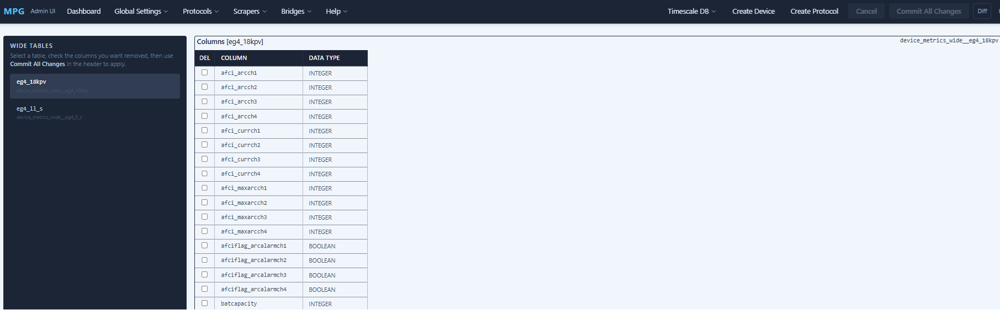
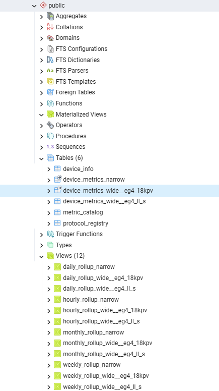

# TimescaleDB Module for Multi Protocol Gateway

---

## Overview

The TimescaleDB module is a **transform / sink transport** for the Multi Protocol Gateway.  
Its primary responsibility is to:

- Receive telemetry data from an upstream scraper transport (e.g. Modbus TCP connected inverter)
- Persist time-series data into a **TimescaleDB (PostgreSQL)** backend
- Detect **stale data conditions**
- Trigger **automatic upstream and downstream reconnects** when data stops flowing
- Enable downstream visualization and analytics via **Grafana**

The module does **not** scrape data itself. Instead, it acts as a consumer of bridged data streams and focuses on persistence, monitoring, and reliability.

---

## Architecture Overview

``` text
[ Inverter / Device ]
          |
          v
[ Modbus / TCP Transport ]
          |
          v
[ Protocol Gateway ]
          |
          v
[ TimescaleDB Transport ]
          |
          v
[ TimescaleDB (Postgres) ]
          |
          v
[ Grafana ]
```

---

## What the TimescaleDB Module Does

### Core Responsibilities

- Converts incoming measurements into normalized rows
- Writes data into hypertables optimized for time-series workloads
- Maintains metadata for scraped devices
- Detects stale data conditions
- Requests upstream reconnects when stale data persists
- Backlogs data during database outages and replays that data on database recovery
- Provide Grafana-ready metrics for visualization

### Stale Data Handling

The module tracks:

- Time since last successful write
- Number of reconnect attempts
- Retry backoff interval

When data becomes stale:

1. A reconnect is requested from the Protocol Gateway
2. The upstream scraper transport is reset and a reconnection is tried
3. Scraping resumes automatically if the device is reachable

---

## 4. Database Schemas

```mermaid
erDiagram
    ProtocolRegistry {
        int protocol_id PK
        text protocol_name UK
        text wide_table_name
        int metric_count
        text rollup_prefix
        boolean rollup_enabled
        boolean rollup_setup_complete
        datetime last_refresh_at
    }

    MetricCatalog {
        int catalog_id PK
        int protocol_id FK
        text metric_name
        text clean_column_name
        text data_type
        float unit_mod
        text notes
    }

    DeviceInfo {
        int device_info_id PK
        int protocol_id FK
        text device_identifier
        text device_serial_number
        text device_name
        text device_manufacturer
        text device_model
        text transport UK
    }

    DeviceMetricsNarrow {
        datetime m_time PK, FK
        int device_info_id PK, FK
        text metric_name PK
        float metric_value
        text metric_ascii
    }

    DeviceMetricsWide {
        datetime m_time PK, FK
        int device_info_id PK, FK
        float dynamic_metric_columns
    }

    ProtocolRegistry ||--o{ MetricCatalog : "has metrics"
    ProtocolRegistry ||--o{ DeviceInfo : "has devices"
    DeviceInfo ||--o{ DeviceMetricsNarrow : "time-series rows"
    DeviceInfo ||--o{ DeviceMetricsWide : "wide rows (metric_count &lt;= 200)"
    ProtocolRegistry ||--o{ DeviceMetricsWide : "creates per-protocol table"
    Application ||--o{ DeviceMetricsWide : "adds dynamic metric columns"
```



### 4.1 Narrow Table

One row per metric per timestamp.

| Column | Description |
| --- | --- |
| m_time | Timestamp |
| device_info_id | Device identifier ID |
| metric | Metric name |
| value | Metric value |

#### Narrow Table Benefits

- Ideal for Grafana
- Flexible schema
- Efficient aggregation

### 4.2 Wide Table (If Less than 200 metrics chosen via the MPG variable filters)

One row per timestamp with multiple metric columns.

| Column | Description |
| --- | --- |
| m_time | Timestamp |
| device_info_id | Device identifier ID |
| inverter_power | Example metric |
| grid_voltage | Example metric |
| panel_voltage | Example metric |
| etc. | etc. |

#### Wide Table Benefits

- Faster inserts
- Easier CSV/SQL exports

#### Wide Table Column Deletion

- You may add and subtract metrics from the wide table to your liking via the mask and screen settings detailed in the MPG readme.  However, if you subtract a metric from the timescaledb bridge, you should delete the column in the wide table that captures that metric.  



### 4.3 Device Info Table

| Column | Description |
| --- | --- |
| device_info_id | Device Identifier ID |
| device_identifier | Device or Inverter Identifier ** |
| device_serial_number | Device or Inverter Serial Number ** |
| device_name | Device of Inverter Informal Name ** |
| device_manufacturer | Device or Inverter Manufacturer |
| device_model | Device or Inverter Model |
| device_firmware | Device or Inverter Firmware |
| device_location | Device or Inverter Location |
| transport | Device or Inverter Scraper Transport |

** =  Determines uniqueness of the Device.

### 4.4 Metric Catalog

| Column | Description |
| --- | --- |
| id | Metric Unique ID |
| metric_name | Metric Name as shown in the MPG Registry |
| clean_column_name | Metric Name sanitized for SQL |
| data_type | Metric Data Type (default Double Precision) |
| created_at | Table Add Date |
| notes | metric name descriptions |

Here is a screen shot of how the schema looks in PGadmin.  The tables reside in the public folder.



---

## 5. Example SQL Queries

### 5.1 Power Over Time

```sql
SELECT
  time_bucket('1 minute', m_time) AS t,
  avg(metric_value) AS power
FROM public.device_metrics_narrow
WHERE metric_name = 'pload'
GROUP BY t
ORDER BY t;
```

### 5.2 Daily Energy Estimate

```sql
SELECT
  date_trunc('day', m_time) AS day,
  sum(metric_value) * 1/60 AS kwh
FROM public.device_metrics_narrow
WHERE metric_name = 'pload'
GROUP BY day
ORDER BY day;
```

### 5.3 Device Health (Last Seen)

```sql
SELECT
  device_info_id,
  max(m_time) AS last_seen
FROM device_metrics_narrow
GROUP BY device_info_id;
```

### 5.4 All metrics from public.device_metrics_wide

```sql
SELECT * FROM public.device_metrics_wide__eg4_18kpv
ORDER BY m_time ASC, device_info_id ASC 
```

---

## 6. Docker Compose Installation

### 6.1 Images Used in the stack

- **TimescaleDB HA:** `timescaledb-ha:pg18`  The Timescale DB Application
     Note that currently this image is approximately 4.5 gb in size.
- **Protocol Gateway:** `buxtoncalvin/multiprotocolgateway:latest` The MPG application/inverter scraper
- **Grafana:** `grafana/grafana:latest`   The graphing application
- **PostGres Admin:** `dpage/pgadmin4:latest` The database administration application

### 6.2 Example docker-compose.yml

```yaml
version: "3.9"

services:

  18kPV_timescaledb:
    container_name: 18kPV_timescaledb
    image: buxtoncalvin/multiprotocolgateway:latest
    restart: always
    security_opt:
    - apparmor:unconfined
    environment:
    - TZ=America/Los_Angeles
    volumes:
    - /home/multiprotocolgateway4/config:/app/config
    - /home/multiprotocolgateway4/protocols:/app/protocols
    - /home/multiprotocolgateway4/backlogs:/app/backlogs
    - /home/multiprotocolgateway4/logs:/app/logs

    ports:
    - "1717:1717"
    expose:
    - "1717"   
    depends_on:
    - timescaledb
    logging:
    driver: "json-file"
    options:
      max-size: "10m" 
      max-file: "3


  timescaledb:
    image: timescale/timescaledb-ha:pg18
    environment:
      POSTGRES_PASSWORD: your-password
      POSTGRES_USER: your-user-name
      POSTGRES_DB: solar (or your database name)
    ports:
      # we change the access port here to allow for other postgres dbs
      - "5431:5432"
    volumes:
   # note the ha version of timescaledb uses a different data storage path compared to the standard postgres database
   # so the volume is mapped in the environment variable to account for any future changes to the path-- which as of 3/3/2026 doesn't work. So direct mapping to timescaledb-ha data folder: /home/postgres/pgdata  
   #- /home/timescaledb:/var/lib/postgresql/data
   # current data path in timescale.
   - /home/timescaledb:/home/postgres/pgdata
  
  grafana:
    container_name: grafana
    image: grafana/grafana:latest
    restart: always
    security_opt:
      - apparmor:unconfined
    ports:
      - 3000:3000
    env_file:
      - '/home/grafana/env.grafana'
    environment:
      - GF_AUTH_ANONYMOUS_ENABLED=true
      - GF_SECURITY_ALLOW_EMBEDDING=true
      - GF_DATABASE_USER=your-user-name
      - GF_DATABASE_PASSWORD=your-password
    user: '1000'    
    depends_on:
      - timescaledb
    volumes:
      - /home/grafana:/var/lib/grafana      

  postgres_admin:
    image: dpage/pgadmin4:latest 
    container_name: pgadmin
    restart: always
    security_opt:
      - apparmor:unconfined     
    environment:
    PGADMIN_DEFAULT_EMAIL: Blah@Gmail.Com
    PGADMIN_DEFAULT_USER: your-user-name
    PGADMIN_DEFAULT_PASSWORD: your-password
    PGADMIN_DISABLE_POSTFIX: true
    volumes:
      - /home/pgadmin:/var/lib/pgadmin
    ports:
      #  set the port to 8181 to avoid typical port 80 conflicts
      - "8181:80" 
    depends_on:
      - timescaledb     

```

---

## General configuration

### 6.3 Grafana Setup

```text

- Open Grafana: <http://localhost:3000>
- Login: admin / admin   or your username/password
- Add data source:
- Type: PostgreSQL
- Host: timescaledb:5431
- Database: metrics
- User: your-TSDB user-name
- Password: your-TSDB-password
- SSL: disabled
- Enable TimescaleDB option
- Create panels using SQL queries

```

### 6.4 MPG Configuration File Simple General (config.cfg)

```ini
[general]
read_mode = sequential

[logging]
log_dir = logs
log_file = gateway.log
level = INFO
# weekly | daily | size
rotation = weekly         
# Monday rollover
when = W0                  
interval = 1
# keep 4 weeks
backup_count = 4           
# 100MB (only if size-based)
max_bytes = 104857600      
console = true

# can be any name in the format transport.<name>
# changing the name will result in a new device being created in the Timescale DB.
[transport.Inverter]
log_level = DEBUG
transport = modbus_tcp
protocol_version = eg4_18kpv
host = 10.17.2.65
port = 502
bridge = transport.timescaledb
read_interval = 15

# Device descriptions used by Timescale for scraping an inverter/device.
manufacturer = EG4
model = 18KPV
serial_number = 4066670074
location = home
name = EG4 18kpv1
# If you want to retrieve the serial number from the inverter, uncomment the below Serial_Number and comment the above.
# You must include Serial_Number in the list in the variable_mask file along with any other variables you want to capture.
# or leave the variable_mask file blank to capture all variables.

# Serial_Number =

[transport.timescaledb]
log_level = DEBUG
transport = timescaledb
host = 10.17.2.42
port = 5431
database = solar1
username =  your-username
password = your-password

### All of the below are optional and are set to defaults if not specified
# force float coerces all values obtained to be of the float type.
force_float = true

# persistent backlog settings
enable_persistent_storage = true
backlog_storage_path = backlogs
backlog_file_name = no_connect_timescale_backlog

# max data points to store in backlog
max_backlog_size = 10000
# seconds-->  equal to 24 hours
max_backlog_age = 86400 

# TSDB Connection monitoring settings
reconnect_attempts = 5
# minutes
reconnect_delay = 5

# Exponential backoff settings (reconnect delay increases exponentially on each failure)
use_exponential_backoff = true
# minutes --> 5 hours
max_reconnect_delay = 300

## hypertable and rollup options
# changing rollup settings after data has been written, will result in automatic view deletions and rebuilds
migrate_data = True
enable_compression = True
enable_dynamic_chunk_sizing = True
enable_rollups = True
# Seconds between rollup refreshes (6 hours)
auto_refresh_interval = 21600
enable_auto_refresh = True
drop_after = 1 year

# stale data cleanup settings minutes --> 5 hours
stale_data_timeout = 300

# pushover settings / leave blank and disable if you don't use pushover
enable_pushover = True
pushover_token = your_token_here
pushover_user = your_user_key_here
# tells MPG to wait until all metrics have been read to write data to timescaledb
write_requires_complete_cycle = True
```

### 6.5 UTC Timestamp Toggle Feature

#### Overview

This feature allows you to configure the TimescaleDB transport to use UTC timestamps instead of the local machine timezone for all time-series data. This is particularly useful for:

- Multi-site deployments across different timezones
- Consistency in timestamp comparison and aggregation
- Simplified rollup boundary calculations
- Easier data interpretation and querying

#### Configuration

##### Setting the UTC Timestamp Mode

Add the following option to your TimescaleDB transport configuration in `config.cfg`:

```ini
[timescaledb_section_name]
host = localhost
port = 5432
database = solar
username = postgres
password = your_password

# Enable UTC timestamps (default: False)
use_utc_timestamp = True
```

##### Default Behavior

- **Default Value**: `False` (uses local machine timezone)
- **Backward Compatible**: Existing deployments continue to use local timezone unless explicitly configured
- **Per-Transport**: The setting is configured per TimescaleDB transport instance

#### How It Works

##### Timestamp Generation

When `use_utc_timestamp = True`:

- All new timestamps are generated in UTC timezone using `datetime.now(timezone.utc)`
- All database timestamp fields use UTC-aware datetime objects

When `use_utc_timestamp = False` (default):

- Timestamps use the local machine timezone via `datetime.now().astimezone()`
- Behavior matches the original implementation

##### Affected Components

###### Database Tables

The following timestamp columns are affected:

- **ProtocolRegistry**: `created_at`, `updated_at`, `last_refresh_at`
- **MetricCatalog**: `created_at`
- **DeviceInfo**: `created_at`, `updated_at`
- **DeviceMetricsNarrow**: `m_time` (primary key - time-series data)
- **DeviceMetricsWide**: `m_time` (time-series data)

###### Rollup Calculations

- The rollup system uses `anchor_start_time_utc` (already UTC-based)
- Time bucket boundaries are calculated correctly with UTC timestamps or local timestamps
- Hierarchical continuous aggregates (hourly → daily → weekly → monthly) work seamlessly

###### Stale Data Detection

- Timestamp comparisons in stale data detection continue to work correctly
- The elapsed time calculation uses the same timezone consistently

#### Implementation Details

##### Initialization Flow

1. Configuration is read from `config.cfg`
2. `use_utc_timestamp` setting is loaded in `TimescaleDB.__init__()`
3. `configure_application_timezone` is called to set the global flag
4. All subsequent timestamp generations of _now_tz use the configured timezone

#### Boundary Conditions and Rollup Alignment

##### Time Bucket Boundaries

TimescaleDB's `time_bucket()` function works with timezone-aware timestamps. The system:

- Uses `anchor_start_time_utc = "2000-01-01 00:00:00+00"` for all rollups
- Aligns hourly buckets to UTC midnight boundaries
- Hierarchically depends on previous aggregates (hourly → daily → weekly → monthly)

##### Example Rollup Bucket Sizes

```ini
- Hourly Rollup: 1 hour bucket, starts 3 hours ago
- Daily Rollup: 1 day bucket, starts 3 days ago
- Weekly Rollup: 1 week bucket, starts 3 weeks ago
- Monthly Rollup: 1 month bucket, starts 3 months ago
```

Whether using UTC or local timezone, these bucket boundaries remain consistent and aligned.

##### Data Consistency

- **No Mixed Timezones**: All timestamps in a transport instance use the same timezone
- **Timezone-Aware**: All datetime objects include timezone information
- **No Conversion Loss**: UTC timestamps have full precision without DST ambiguity

#### Migration Considerations

##### Switching from Local to UTC

⚠️ **Important**: Switching the `use_utc_timestamp` setting after data has been collected will result in:

- Existing data retains its original timezone
- New data uses the new timezone setting
- A temporal discontinuity at the transition point

**Recommendation**:

- Set the timezone mode before data collection begins, or
- Create a new database/transport instance if changing timezones mid-operation

##### Data Continuity

If you must transition:

1. Document the switch time
2. Consider data export/reimport with timezone conversion
3. Set up separate rollup views if needed to handle the transition period

#### Usage Examples

##### Configuration Example 1: UTC for Cloud Deployment

```ini
[timescaledb]
host = cloud-tsdb.example.com
port = 5432
database = solar
username = cloud_user
password = ${TSDB_PASSWORD}
use_utc_timestamp = True
enable_rollups = True
auto_refresh_interval = 21600
```

##### Configuration Example 2: Local Timezone (Default)

```ini
[timescaledb]
host = localhost
port = 5432
database = solar
username = postgres
password = postgres
use_utc_timestamp = False  # Default, can be omitted
```

##### Programmatic Configuration

```python
from configparser import ConfigParser
from MultiProtocolGateway.classes.transports.timescaledb import TimescaleDB

config = ConfigParser()
config.read('config.cfg')

# Enable UTC timestamps
config['timescaledb']['use_utc_timestamp'] = 'True'

# Initialize transport
tsdb_transport = TimescaleDB(config['timescaledb'])
# Timestamps will now use UTC
```

#### Query Examples

##### Querying Data with Different Timezones

```sql
-- When using UTC timestamps, all comparisons are in UTC
-- Query data from the last 24 UTC hours
SELECT * FROM device_metrics_narrow
WHERE m_time >= NOW() - INTERVAL '1 day'
ORDER BY m_time DESC;

-- Time zone conversion on query (if needed for display)
SELECT 
    m_time AT TIME ZONE 'US/Eastern' as local_time,
    metric_name,
    metric_value
FROM device_metrics_narrow
WHERE m_time >= NOW() - INTERVAL '1 day'
ORDER BY m_time DESC;
```

##### Verifying Timestamp Timezone

```sql
-- Check the timezone of timestamps
SELECT 
    m_time,
    timezone(m_time) as tz,
    m_time AT TIME ZONE 'UTC' as in_utc
FROM device_metrics_narrow
LIMIT 1;
```

#### Troubleshooting

##### Issue: Timestamps Still in Local Timezone

**Cause**: Configuration not reloaded or transport not restarted
**Solution**: Restart the transport service after changing the configuration

##### Issue: Rollup Views Not Updating

**Cause**: Timezone boundary misalignment in legacy data
**Solution**: Verify `anchor_start_time_utc` setting and consider dropping/recreating views

##### Issue: Historical Data Shows Wrong Timezone

**Cause**: Settings changed mid-operation
**Solution**: This is expected behavior - see "Migration Considerations" section

#### Technical Notes

##### Why UTC for Rollups?

- **Consistency**: UTC eliminates DST (Daylight Saving Time) complications
- **Simplicity**: Hour boundaries are always at UTC hour marks
- **Correctness**: No ambiguous times during DST transitions
- **Interoperability**: Works seamlessly across timezones

##### DateTime Behavior

- **`datetime.now(timezone.utc)`**: Returns current time in UTC with UTC tzinfo
- **`datetime.now().astimezone()`**: Returns current time in local timezone with local tzinfo
- **`datetime.now()`**: Returns naive datetime (no timezone info) - NOT USED

All timestamps generated by this system are timezone-aware to prevent ambiguity.

#### References

- [Python datetime.timezone documentation](https://docs.python.org/3/library/datetime.html#datetime.timezone)
- [TimescaleDB time_bucket function](https://docs.timescaledb.com/latest/api/#time_bucket)
- [TimescaleDB continuous aggregates](https://docs.timescaledb.com/latest/overview/continuous-aggregates/)

---

## Summary

The TimescaleDB module provides a production-grade ingestion and monitoring layer that integrates cleanly with the Multi Protocol Gateway. It is designed to be predictable, observable, and resilient — pairing naturally with inverter telemetry, industrial sensors, and edge data collection workloads.

The TimescaleDB module provides:

- Reliable time-series persistence
- Automatic stale data detection
- Self-healing reconnect behavior
- Support for Grafana visualization
