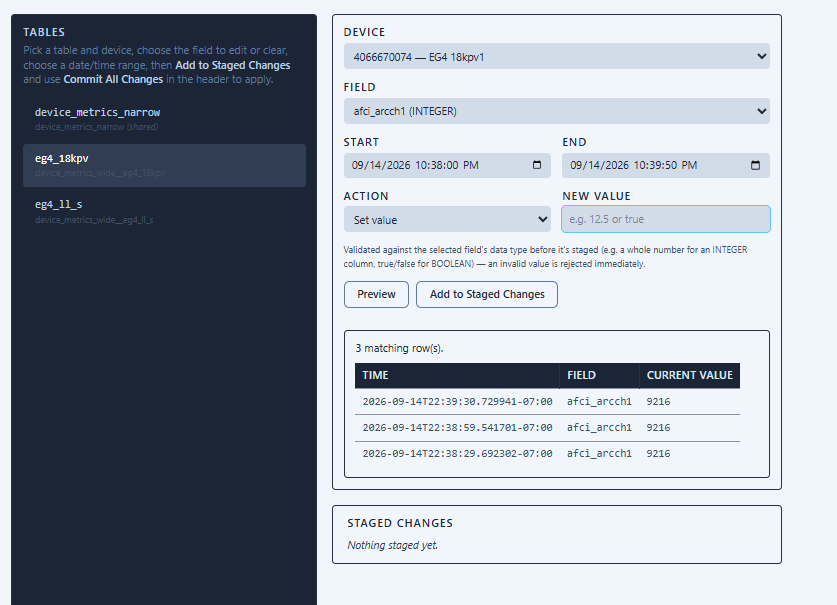
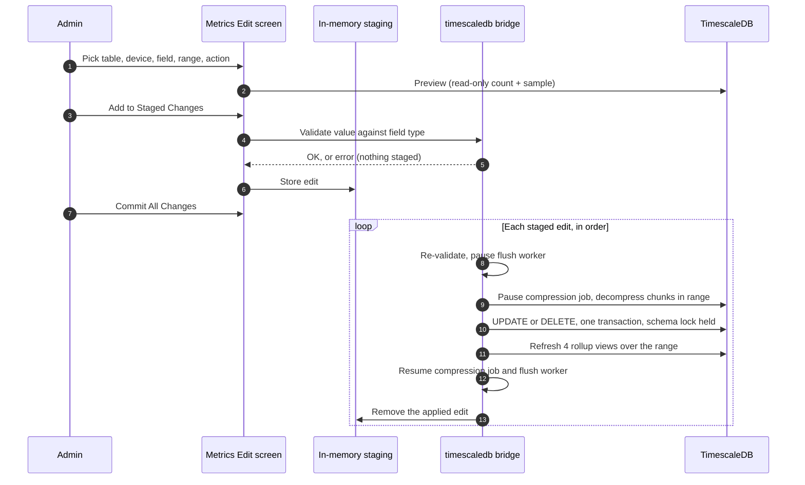
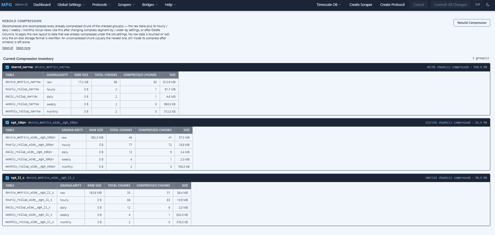
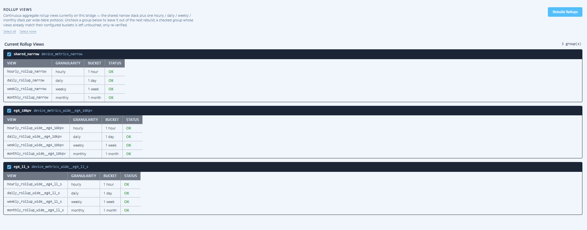
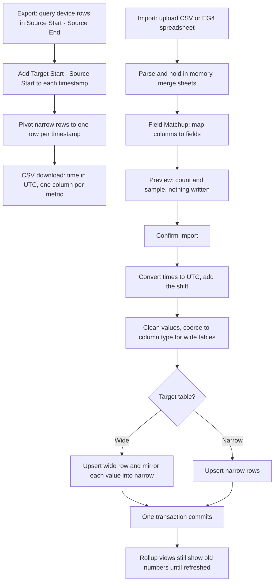

# TimescaleDB Module for Multi Protocol Gateway

---

## Overview

The TimescaleDB module is a **transform / sink transport** for the Multi Protocol Gateway.  
Its primary responsibility is to:

- Receive telemetry data from an upstream scraper transport (e.g. Modbus TCP connected inverter)
- Persist time-series data into a **TimescaleDB (PostgreSQL)** backend
- Detect **stale data conditions**
- Trigger **automatic upstream and downstream reconnects** when data stops flowing
- Enable downstream visualization and analytics via **Grafana**

The module does **not** scrape data itself. Instead, it acts as a consumer of bridged data streams and focuses on persistence, monitoring, and reliability.

---

## Architecture Overview

``` text
[ Inverter / Device ]
          |
          v
[ Modbus / TCP Transport ]
          |
          v
[ Protocol Gateway ]
          |
          v
[ TimescaleDB Transport ]
          |
          v
[ TimescaleDB (Postgres) ]
          |
          v
[ Grafana ]
```

---

## What the TimescaleDB Module Does

### Core Responsibilities

- Converts incoming measurements into normalized rows
- Writes data into hypertables optimized for time-series workloads
- Maintains metadata for scraped devices
- Detects stale data conditions
- Requests upstream reconnects when stale data persists
- Backlogs data during database outages and replays that data on database recovery
- Provide Grafana-ready metrics for visualization
- Lets an administrator correct historical values (Metrics Edit, section 4.5) and export, time-shift and re-import data (Timeshift Data, section 4.7) from the web UI

### Stale Data Handling

The module tracks:

- Time since last successful write
- Number of reconnect attempts
- Retry backoff interval

When data becomes stale:

1. A reconnect is requested from the Protocol Gateway
2. The upstream scraper transport is reset and a reconnection is tried
3. Scraping resumes automatically if the device is reachable

---

## 4. Database Schemas

  ! [Timescale DB Architecture](../../../documentation/architecture/mermaid-diagrams.md#timescaledb-telemetry-schema-created-by-timescaledb-bridge)

### 4.1 Narrow Table

One row per metric per timestamp.

| Column | Description |
| --- | --- |
| m_time | Timestamp |
| device_info_id | Device identifier ID |
| metric_name | Metric name |
| metric_value | Numeric metric value (booleans stored as 1/0) |
| metric_ascii | Text metric value; empty for numeric metrics |

#### Narrow Table Benefits

- Ideal for Grafana
- Flexible schema
- Efficient aggregation

### 4.2 Wide Table (If Less than 160 metrics chosen via the MPG variable filters)

One row per timestamp with multiple metric columns.

| Column | Description |
| --- | --- |
| m_time | Timestamp |
| device_info_id | Device identifier ID |
| inverter_power | Example metric |
| grid_voltage | Example metric |
| panel_voltage | Example metric |
| etc. | etc. |

#### Wide Table Benefits

- Faster inserts
- Easier CSV/SQL exports

#### Wide Table Column Deletion

- You may add and subtract metrics from the wide table to your liking via the mask and screen settings detailed in the MPG readme.  However, if you subtract a metric from the timescaledb bridge, you should delete the column in the wide table that captures that metric.  


> **Note:** Delete Columns changes a wide table's *shape* — it drops a column outright, for every device and every timestamp. To correct or remove specific *values* (e.g. a bad reading from a sensor fault, or data captured during a known test/outage) for one device over a chosen time range without touching the schema, use **Metrics Edit** instead — see section 4.5 below.

### 4.3 Device Info Table

| Column | Description |
| --- | --- |
| device_info_id | Device Identifier ID |
| device_identifier | Device or Inverter Identifier ** |
| device_serial_number | Device or Inverter Serial Number ** |
| device_name | Device of Inverter Informal Name ** |
| device_manufacturer | Device or Inverter Manufacturer |
| device_model | Device or Inverter Model |
| device_firmware | Device or Inverter Firmware |
| device_location | Device or Inverter Location |
| transport | Device or Inverter Scraper Transport |

** =  Determines uniqueness of the Device.

### 4.4 Metric Catalog

One row per metric per protocol — the record of every metric a protocol has ever reported, and, for a wide-table protocol, which column it lives in. Metrics Edit's and Wide Table Column Deletion's own column lists are read from here, and this is also the table those two screens' whitelist checks validate a column name against before it's ever used to build SQL.

| Column | Description |
| --- | --- |
| catalog_id | Metric unique ID (primary key) |
| protocol_id | Foreign key to `protocol_registry` — which protocol this metric belongs to |
| metric_name | Metric name as reported by the protocol/scraper |
| clean_column_name | `metric_name` sanitized into a valid SQL column name (wide tables only — this is the actual column name on the protocol's wide table) |
| data_type | Column's declared Postgres type, e.g. `DOUBLE PRECISION`, `SMALLINT`, `BOOLEAN`, `TEXT` (default `DOUBLE PRECISION`) |
| unit_mod | Optional unit-conversion multiplier applied to the raw value before it's stored |
| created_at | Row created (or last updated) date |
| notes | Free-text description of the metric |

`(protocol_id, metric_name)` and `(protocol_id, clean_column_name)` are each unique, so the same metric name can exist under different protocols, and two protocols can independently use the same column name on their own wide tables.

Here is a screen shot of how the schema looks in PGadmin.  The tables reside in the public folder.


---

### 4.5 Metrics Edit — Editing or Deleting Historical Metric Values

The **Timescale DB → Metrics Edit** admin screen lets an administrator correct or remove specific metric *values* — for one device, over a chosen date/time range — on either the shared narrow table or a wide table, without changing either table's schema. This is the tool to reach for when a sensor fault, a mis-wired input, a device test, or a known outage window put bad or unwanted values into the database and you want them fixed or cleared, as opposed to Wide Table Column Deletion (section 4.2), which permanently drops an entire metric column, table-wide, for every device and timestamp.

> **One table per edit.** Live data is written to the narrow table *and*, when the protocol has one, to its wide table. Metrics Edit changes only the table you select. To correct a value everywhere it was recorded, make the same edit once against the narrow table and once against the wide table.



#### Using the Metrics Edit Screen

1. Open **Timescale DB → Metrics Edit** from the admin menu.
2. Pick a **table** on the left — either the shared `device_metrics_narrow` table, or one wide-table protocol.
3. Pick the **device** whose data you want to edit. Only devices that already have at least one row in the selected table are listed, so a device that has only ever written to the narrow table will not appear when a wide table is selected, and vice versa.
4. Pick the **field** to target from the dropdown — **one field per edit**. For a wide table the list is the protocol's metric columns, shown with their declared data type. For the narrow table it is the distinct metric names already recorded for the chosen device. Only one field is allowed because a single replacement value is applied to whatever is selected, and different metrics can have different types (for example an `INTEGER` and a `BOOLEAN`). To change several metrics, stage one edit per metric.
5. Pick a **start** and **end** date/time for the range to affect. Both ends are inclusive. The range is interpreted in the same timezone the bridge stamps rows with: the machine's local timezone, or UTC when `use_utc_timestamp = True` (see section 6.5).
6. Choose an **action**:
   - **Delete value(s)** — clears the selected field over the range.
   - **Set value** — overwrites the selected field with a replacement value you enter.
7. Click **Preview** to see how many rows match and a sample of their current values (up to the 25 most recent matching rows) before changing anything. Preview is a plain read: it does not lock, pause, or decompress anything. For a wide table the count is the number of rows for that device in the range, whether or not the selected column currently holds a value in each of them.
8. Click **Add to Staged Changes** and confirm the browser prompt. The value is validated first (see "Value Type Validation"); an invalid value is rejected at this step and nothing is staged.
9. Use the **Commit All Changes** button in the header to apply every staged Metrics Edit (and any staged Delete Columns changes) at once. Nothing is written to TimescaleDB before this step. Staged edits can be reviewed and individually removed from the Staged Changes list, or abandoned entirely with **Discard Changes**.

#### Staging

Each press of **Add to Staged Changes** stores one complete edit request: table, device, field, time range, action, and replacement value. Several edits can be staged before a commit, even against the same table and device, and they are applied in the order they were staged.

Staged edits are held in memory by the running MPG web server. They are not written to `config.cfg`, to the SQLite staging database, or to TimescaleDB. They survive navigating between admin pages, but are lost if MPG is restarted before you commit.

#### Narrow vs. Wide Behavior

The two table shapes require slightly different semantics for "delete," since a narrow row holds a single metric while a wide row holds every metric for that device/timestamp:

| Table | Delete | Set Value |
| --- | --- | --- |
| Narrow (`device_metrics_narrow`) | Removes the matching `(m_time, device_info_id, metric_name)` rows outright | Numeric metric: sets `metric_value` and clears `metric_ascii`. Text metric: sets `metric_ascii` and sets `metric_value` to `0`. |
| Wide (`device_metrics_wide__*`) | Sets the selected column to `NULL` for every row of that device in the range — the row itself can't be removed, since it also holds every other metric recorded at that timestamp | Overwrites the selected column in place for every row of that device in the range |

Metrics Edit only ever changes rows that already exist. It never inserts a row and never adds or drops a column.

#### Value Type Validation

A replacement value entered for **Set Value** is checked against the field's type before it is staged, and checked again at commit time, because a column's type or existence can change in between (for example, a Delete Columns change committed in the meantime):

- **Wide table columns** are checked against their declared `metric_catalog.data_type`. An `INTEGER`, `SMALLINT` or `BIGINT` column rejects non-whole numbers and out-of-range values, a `BOOLEAN` column accepts `true`/`false`, `t`/`f`, `1`/`0`, `yes`/`no` and `on`/`off`, and a `TEXT` column accepts anything.
- **Narrow table metrics** have no fixed declared type (every metric shares the same `metric_value`/`metric_ascii` pair), so the screen infers numeric vs. text from what is already recorded for that device and metric: if any existing row has `metric_ascii` populated the metric is treated as text, otherwise as numeric. A metric with no existing rows defaults to numeric. A numeric metric only accepts a value that parses as a number.

An invalid value is rejected immediately, with a clear error, rather than only surfacing when Commit All Changes is pressed.

#### What Happens on Commit

**Commit All Changes** applies pending work in this order: configuration changes, staged Delete Columns changes, staged Metrics Edit changes, then staged InfluxDB edits. Each staged Metrics Edit is then run on its own, in staging order:

1. The bridge's flush worker is paused. Live readings keep arriving and are queued, and the worker writes them as soon as the edit finishes, so no data is lost.
2. Any compression job configured for the affected table is paused, and only the chunks overlapping the edited time range are decompressed. Chunks elsewhere are left compressed, since the edit never writes outside the range.
3. The `UPDATE`/`DELETE` runs in a single transaction under the same schema locks used for structural changes, so it can't race a concurrent Delete Columns commit against the same table.
4. The four rollup views (hourly, daily, weekly, monthly) for that table's own stack are refreshed over the edited range, so pre-aggregated rollups reflect the correction instead of continuing to serve the old numbers. If the range is narrower than a view's bucket (for example a few minutes against a weekly bucket), the refresh window is widened to whole buckets.
5. The flush worker and the compression job are resumed, whether or not the edit succeeded. The chunks that were decompressed are compressed again later by the normal compression policy.



**If something fails.** A failure while applying an edit stops the remaining edits and the commit reports an error. Edits that already completed are removed from staging, so they are not applied a second time; the edit that failed, and any after it, stay staged so the commit can be retried once the cause is fixed. A common cause is a staged Delete Columns change that removed the column a later staged edit targets: the edit is re-validated at commit and refused. If only the rollup refresh in step 4 fails, the edit itself has already been applied; the failure is written to the log as a warning. Run **Rebuild Rollup Views** (section 4.6) to bring the rollups back in line.

No row data outside the selected device, field, and time range is ever touched.

### 4.6  Rebuilds:  Compression and Rollups

#### Rebuild Compression

The **Timescale DB → Rebuild Compression** admin screen decompresses and recompresses every already-compressed chunk of a raw table (narrow or wide) and its four rollup views, in place, against whatever compression settings are configured **right now**. It never touches a view's definition and never adds, removes, or modifies a single row of data — this is purely a rewrite of how existing rows are stored on disk.

You need this after a change that alters a table's physical layout but doesn't retroactively apply to data already compressed:

- Changing `compress_segmentby` / `compress_orderby` in `hypertable_defaults` — new chunks pick up the change automatically, but chunks compressed under the old settings won't until they're rewritten.
- Running **Wide Table Column Deletion** — dropping a column requires decompressing every currently-compressed chunk of that wide table first (`ALTER TABLE ... DROP COLUMN` can't run against a compressed one), so the whole table is left decompressed afterward. It stays that size on disk, without the dropped column's old data taking any extra room, until the next scheduled compression pass or a manual **Rebuild Compression** rewrites it under the current (now-smaller) column list.
- After a **Metrics Edit** (section 4.5) or a **Timeshift Data** import (section 4.7) — both decompress only the chunks that overlap the range they touched, not the whole table, since neither one writes outside that range or changes the column layout. Those chunks are recompressed the same way, by the normal schedule or by running Rebuild Compression sooner for that group.



##### Using the Rebuild Compression Screen

1. Open **Timescale DB → Rebuild Compression** from the admin menu.
2. Check the group(s) to rebuild — the shared narrow stack, and/or one or more wide-table protocols. **Select all** / **Select none** are provided for convenience.
3. Click **Rebuild Compression**. You'll be asked to confirm, since this touches every compressed chunk in the selected group(s) — the operation itself is safe (no data is lost), but it can take a while on a large table.
4. Progress streams live as chunks are rewritten, with a single progress bar covering every selected group.
5. When finished, each group (and each table within it — the raw table plus its hourly/daily/weekly/monthly rollup views) reports its size before and after, and the percentage reduced.

##### What Gets Touched

For each selected group, every table in its stack — the raw narrow/wide table, plus its hourly, daily, weekly, and monthly rollup views — is checked for compressed chunks. Only chunks TimescaleDB already reports as compressed are touched; the newest chunk(s), still inside their `compress_after` window and not yet compressed by the background policy, are left alone. Each touched chunk is decompressed and immediately recompressed against the hypertable's current compression settings.

##### Rollup Progress and Results

Progress is weighted by each table's on-disk byte size rather than by a simple chunk count, since chunk counts aren't comparable across a group's members — a rollup view routinely has several times as many chunks as its raw table for the same span of time, while the raw table's individual chunks are much larger. Splitting each table's own known size evenly across its own chunks gives a progress bar that advances smoothly instead of racing through one table and stalling on another.

Each table's scheduled compression job is paused only while that table's own chunks are being rewritten, and is always resumed afterward, whether or not every chunk succeeded. Every chunk is attempted independently — one chunk failing to decompress or recompress (for example, due to a momentary lock conflict) does not stop the rest of that table, the rest of its group, or any other selected group.

#### Rebuild Rollup Views

The **Timescale DB → Rebuild Rollup Views** admin screen manages the four-tier continuous aggregate rollups (hourly → daily → weekly → monthly) built on top of the narrow table and each wide table. Each tier is materialized from the one below it, so the whole hourly/daily/weekly/monthly stack for a given source table is always treated as a single unit — there's no way to rebuild or refresh just one tier in isolation without risking it being built against a stale or mismatched source.



##### Using the Rebuild Rollup Views Screen

1. Open **Timescale DB → Rebuild Rollup Views** from the admin menu.
2. Check the group(s) to act on — the shared narrow stack, and/or one or more wide-table protocols. **Select all** / **Select none** are provided for convenience.
3. Choose one of the three actions below. **Force Rebuild** asks for confirmation first, since it always drops and recreates every selected group's views regardless of whether anything looks wrong.
4. Progress streams live as each group (or, for **Refresh Now**, each individual view) is processed.
5. When finished, the screen reports each group's/view's outcome, including whether it was actually changed or left as-is.

##### The Three Actions

| Action | What It Does | When To Use It |
| --- | --- | --- |
| **Refresh Now** | Pulls the latest raw data into each selected view's *existing* definition (`CALL refresh_continuous_aggregate`) — the same thing the background refresh policy does on its own schedule, so it only covers each view's recent window (by default 3 hours, 3 days, 3 weeks and 3 months for hourly, daily, weekly and monthly). Never drops or recreates a view. | Routine catch-up between scheduled refreshes, or after a **Timeshift Data** import (section 4.7) into that recent window. **Metrics Edit** already refreshes the rollups for its own edited range, so it doesn't need this. |
| **Rebuild Rollups** | Purges and fully re-materializes a selected group's whole rollup stack, but only for groups that actually need it — a missing view, or one whose bucket configuration no longer matches `config.cfg`. A group that already checks out is left untouched. | After changing rollup bucket/backfill settings, or after wide-table columns changed via **Delete Columns** and the rollups look out of sync. |
| **Force Rebuild** | Purges and fully re-materializes every selected group's whole stack unconditionally, regardless of whether it looked out of date. | When you suspect drift or corruption the normal check wouldn't catch, or you simply want a guaranteed clean rebuild. Also the way to bring the rollups up to date after a **Timeshift Data** import into an older date range (section 4.7). |

##### Why Whole Stacks, Not Individual Views

The daily rollup is built from the hourly rollup, the weekly rollup from the daily, and the monthly rollup from the weekly. Because of that hierarchy, rebuilding or force-rebuilding always operates at the level of a whole source-table stack (the shared narrow stack, or one wide-table protocol) — never an individual hourly/daily/weekly/monthly view on its own — so a rebuilt tier is never left pointing at a stale or mismatched layer beneath it. **Refresh Now** is the exception: since it never drops or recreates anything, it can and does report progress per individual view.

##### Progress and Results

**Rebuild Rollups** and **Force Rebuild** report progress per group, since each one delegates to the same internal setup routine the bridge uses on startup/reconnect, which rebuilds its whole stack as a single step. **Refresh Now** reports progress per individual view, since it already loops over each one independently. In every case, each group or view is attempted on its own — one failure doesn't block the rest of the selection from completing.

### 4.7 Timeshift Data — Exporting, Shifting and Importing Historical Data

The **Timescale DB → Timeshift Data** admin screen (`/pages/timeshift-data?version=timescale`) moves a block of historical data through a CSV file, optionally shifting every timestamp by a fixed amount on the way. It has two uses:

- **Export** a device's date range from a narrow or wide table as a CSV, with the timestamps shifted to a different start time if you want. This is how you copy a known-good day onto another day, or take data out for editing in a spreadsheet.
- **Import** a CSV back in, again with an optional shift. The CSV can be one this same screen exported (optionally edited in a spreadsheet first), or a spreadsheet downloaded from the EG4 monitoring website. The EG4 option is offered only when at least one `eg4_*` protocol is configured on the gateway.

The same screen also serves InfluxDB v1 and v3; a toggle at the top of the page switches between the destinations that have a connected bridge. This section describes what happens for TimescaleDB. See the [InfluxDB documentation](../InfluxDB/influxdb.md) for the others.

**Timeshift Data does not use the staging and Commit All Changes flow** that Delete Columns and Metrics Edit use. Export downloads a file immediately, Preview is read-only, and **Import writes to the database as soon as you confirm the dialog**.

#### Settings Common to Export and Import

- **Table** — the shared narrow table, or one protocol's wide table. A protocol only appears as a wide table once it has one.
- **Device** — the device every row in this export or import belongs to. As on the Metrics Edit screen, only devices that already have at least one row in the selected table are listed, so you cannot import into a table for a device that has no rows there yet.
- **Local Machine Timezone** — preselected to the bridge's configured timezone. It is used to interpret the Source Start, Source End and Target Start fields you type, and to interpret timestamps in an EG4 spreadsheet, which are naive local times.
- **Metric Match Confidence Threshold** — how closely an EG4 column name must match a database field name before it is pre-filled in the Field Matchup table (default `0.85`). Not used for re-imported CSVs.
- **Allow float coercion** and **Delete existing points in target range first** are shown but disabled for TimescaleDB. Values written to a wide table are always coerced to the column's declared type, and existing data is never deleted by an import. Use Metrics Edit if you need to clear a range first.

#### How the Time Shift Is Calculated

You enter a **Source Start** and a **Target Start**. The shift is `Target Start − Source Start`, and that one amount is added to every timestamp. Leave the two equal for no shift.

The two times are compared as real instants (both converted to UTC first), so a shift across a daylight-saving change, such as a June source moved onto a January target, lands exactly where you asked rather than an hour off.

#### Export: Date Range to CSV

1. Choose the **Export** source option, then the table and device.
2. Enter a **Source Start** and **Source End**. Both ends are inclusive.
3. Enter a **Target Start**, or leave it equal to Source Start for an unshifted copy.
4. Click **Export to CSV**. Your browser's Save dialog is where the file goes.

What the export does:

- It runs a read-only query for that device over the range. Nothing in the database changes.
- A **wide** table is exported as it is: one row per timestamp, one column per metric. A **narrow** table stores one row per metric per timestamp, so it is pivoted into the same wide shape: one row per distinct timestamp, one column per metric name seen in the range. Text metrics come from `metric_ascii`, numeric ones from `metric_value`. A narrow export and a wide export therefore produce files of the same shape, and either can be re-imported the same way.
- The first column is `time`. It holds the *shifted* timestamp, written in **UTC** as an ISO-8601 value without a timezone suffix. Empty database values (`NULL`) become blank cells.
- The file is named `<table>_<start date>_<end date>_vtimescale.csv`.

#### Import: EG4 Spreadsheet or Exported CSV

1. Choose **Import EG4 spreadsheet** or **Re-import an exported/edited CSV**, then the table and device.
2. Choose the **file** (`.csv`, `.xls` or `.xlsx`, up to 25 MB).
3. Enter **Source Start** and **Target Start**. For an EG4 upload, Source Start defaults to the earliest timestamp found in the file.
4. Click **Upload & Scan Fields**. The file is parsed and held in memory on the MPG web server, and the **Field Matchup** table appears. The uploaded file is not saved to disk, and it is lost if MPG restarts.
5. Pick the **Time Column**. The page guesses one where it can.
6. Review the Field Matchup table (below) and adjust any row.
7. Click **Preview** to see how many rows would be written, anything that would be skipped (missing times, unmapped columns, type conflicts), and the first 10 rows with their shifted timestamps. Nothing is written. Use it to catch a wrong Time Column or an unmapped field before the real import.
8. Click **Import to TimescaleDB** and confirm the dialog. The rows are written immediately.

**Reading the file.** A workbook with several sheets is merged into one table joined on timestamp. Sheets covering different time ranges are stacked, and sheets with different columns for the same times are placed side by side. Where two sheets disagree about the same column at the same timestamp, the earlier sheet's value is kept and a warning names the sheets and columns. A sheet with no data or no recognizable time column is skipped and reported.

**Interpreting timestamps.** In an EG4 spreadsheet, times are naive *local* times, read in the Local Machine Timezone. In a re-imported CSV, naive times are read as **UTC**, which matches how the export writes them. Each time is converted to UTC and then the shift is added. Rows whose time is missing or unreadable are skipped and counted.

> **Shifting twice.** A CSV that was exported with a Target Start different from its Source Start already contains the shifted timestamps. When you re-import it, leave Source Start equal to Target Start unless you want the data shifted a second time.

**Field Matchup.** Each source column gets one row showing which database field it will be written to:

- For a **re-imported CSV**, column names already are the database field names, so the mapping is one-to-one and is shown for review.
- For an **EG4 spreadsheet**, column names rarely match, so each is fuzzy-matched against the table's existing fields. A match at or above the confidence threshold is pre-filled. A column below the threshold starts with **Ignore this column** ticked, because an EG4 export carries many columns MPG never records. You can un-tick Ignore and pick a field yourself.
- The target list is the wide table's existing columns, or, for the narrow table, the metric names already recorded for the selected device. A **+ New field…** entry, to create a new metric name, is offered for the narrow table only. A wide table cannot gain a column here, since that would need an `ALTER TABLE`, which this screen never runs; write a brand-new metric to the narrow table instead.
- The column you choose as the **Time Column** is used only for the timestamp and is never written as a value. A column literally named `time` or `measurement` starts with Ignore ticked.

**Cleaning values.** Each cell is normalized before it is written: hex text such as `0x1478` becomes an integer, `25%` becomes `25.0`, numeric text becomes an integer or float, and blank cells are dropped, so a blank never overwrites an existing value. For a wide table, each value must then fit its column's declared type (a fractional value into an `INTEGER` column, text into a numeric column, or a number outside an integer type's range does not). A value that does not fit is skipped and reported as a type conflict; it does not fail the import. Narrow-table values are not type-checked, because the narrow table has no per-metric type. Rows left with no values at all are skipped and counted.

#### What the Import Writes

The import connects directly to the TimescaleDB bridge and writes in one database transaction: either every row is written, or none is.

- **Narrow table.** Each value becomes one row in `device_metrics_narrow`, keyed on `(m_time, device_info_id, metric_name)`. Numbers, and booleans as `1`/`0`, go to `metric_value`; text goes to `metric_ascii` with `metric_value` set to `0`.
- **Wide table.** Each source row is written to the wide table keyed on `(m_time, device_info_id)`, and **the same values are also written to `device_metrics_narrow`**, using the column name as the metric name. The narrow table is the durable long-format record and the wide table is derived from it, so an import into a wide table keeps them consistent. The result message reports how many values were mirrored into the narrow table.
- **Overwrite, not skip.** Both writes are upserts. If a row already exists at the same timestamp for that device, the imported value replaces it. In a wide table only the columns you mapped and that had a value are changed; other columns at that timestamp keep what they had. If no row exists, one is created. This makes re-running the same import over the same range safe, but it also means an import overlapping live readings at identical timestamps replaces them. Existing rows in the target range that the file does not mention are left alone.
- **No queue, no backlog.** The import bypasses the live write path: it does not use the flush queue or the stale-data check, and nothing is saved to the persistent backlog. If the bridge is not connected to TimescaleDB, the import fails immediately with an error instead of being retried later.
- **Compression is handled, but more lightly than Metrics Edit.** A Timeshift import commonly targets an older range, which is often already compressed by the time an admin gets to it. Before writing, the import pauses the compression job (if any) and decompresses just the chunks overlapping the batch's own time range — on both the wide table (for a wide import) and `device_metrics_narrow` — the same range-scoped step Metrics Edit uses, and just as best-effort: a table with nothing to decompress simply no-ops. Unlike Metrics Edit, the import does **not** pause the flush worker or take the schema lock, so live ingestion continues normally while it runs. Decompressed chunks are recompressed later by the normal schedule, or immediately with Rebuild Compression (section 4.6). If the import fails part-way, the transaction rolls back and no rows are kept; the paused job is resumed regardless.
- **Rollups are not refreshed.** The hourly/daily/weekly/monthly rollup views do not know about imported rows until they are refreshed (see below).



#### After an Import: Refresh the Rollups

Live data reaches the rollup views through the scheduled background refresh. That refresh only looks back over each view's own window, which by default is 3 hours for hourly, 3 days for daily, 3 weeks for weekly and 3 months for monthly rollups. **Refresh Now** on the Rebuild Rollup Views screen (section 4.6) covers the same windows.

- If the shifted data landed **inside those windows**, the rollups catch up on their own at the next scheduled refresh, or immediately with **Refresh Now**.
- If it landed **further back**, neither will pick it up. Use **Force Rebuild** for the affected group (the shared narrow stack, and the wide-table protocol if you imported into one), which re-materializes every rollup tier from the raw data. Because a wide-table import also writes the narrow table, refresh both stacks.

Grafana panels that read the raw tables show imported data straight away. Only panels that read the rollup views need the refresh.

#### Import Results

After a successful import the screen reports the number of rows written (one per source row), the number of values mirrored into the narrow table for a wide-table import, rows skipped for a missing time or for having no usable values, columns left unmapped, and values skipped for a type conflict.

### 4.8 How the Three Ways of Changing Data Compare

| | Live ingestion | Metrics Edit (4.5) | Timeshift Data import (4.7) |
| --- | --- | --- | --- |
| **Where data comes from** | Scraper, via the bridge's flush queue | Existing rows in the selected table | An uploaded CSV or EG4 spreadsheet |
| **Tables written** | Narrow, plus wide when the protocol has one | Only the one table you select | Narrow; a wide-table import also writes the wide table |
| **Existing rows** | Narrow: a duplicate is skipped. Wide: plain insert | Updated or deleted | Overwritten if the timestamp already exists |
| **Staged until Commit All Changes** | No | Yes | No — writes on confirm |
| **Flush worker paused** | No | Yes, for the duration | No |
| **Compression** | Background policy | Job paused, chunks in range decompressed | Job paused, chunks in range decompressed (same as Metrics Edit, but the flush worker keeps running) |
| **Rollup views** | Background refresh | Refreshed automatically over the edited range | Not refreshed; refresh or rebuild afterward |
| **If TimescaleDB is down** | Queued to the persistent backlog (when `enable_persistent_storage` is on) and replayed later | Fails; the edit stays staged | Fails immediately; nothing is kept |

---

## 5. Example SQL Queries

### 5.1 Power Over Time

```sql
SELECT
  time_bucket('1 minute', m_time) AS t,
  avg(metric_value) AS power
FROM public.device_metrics_narrow
WHERE metric_name = 'pload'
GROUP BY t
ORDER BY t;
```

### 5.2 Daily Energy Estimate

```sql
SELECT
  date_trunc('day', m_time) AS day,
  sum(metric_value) * 1/60 AS kwh
FROM public.device_metrics_narrow
WHERE metric_name = 'pload'
GROUP BY day
ORDER BY day;
```

### 5.3 Device Health (Last Seen)

```sql
SELECT
  device_info_id,
  max(m_time) AS last_seen
FROM device_metrics_narrow
GROUP BY device_info_id;
```

### 5.4 All metrics from public.device_metrics_wide

```sql
SELECT * FROM public.device_metrics_wide__eg4_18kpv
ORDER BY m_time ASC, device_info_id ASC 
```

---

## 6. Docker Compose Installation

### 6.1 Images Used in the stack

- **TimescaleDB HA:** `timescaledb-ha:pg18`  The Timescale DB Application
     Note that currently this image is approximately 4.5 gb in size.
- **Protocol Gateway:** `buxtoncalvin/multiprotocolgateway:latest` The MPG application/inverter scraper
- **Grafana:** `grafana/grafana:latest`   The graphing application
- **PostGres Admin:** `dpage/pgadmin4:latest` The database administration application

### 6.2 Example docker-compose.yml

```yaml
version: "3.9"

services:

  18kPV_timescaledb:
    container_name: 18kPV_timescaledb
    image: buxtoncalvin/multiprotocolgateway:latest
    restart: always
    security_opt:
    - apparmor:unconfined
    environment:
    - TZ=America/Los_Angeles
    volumes:
    - /home/multiprotocolgateway4/config:/app/config
    - /home/multiprotocolgateway4/protocols:/app/protocols
    - /home/multiprotocolgateway4/backlogs:/app/backlogs
    - /home/multiprotocolgateway4/logs:/app/logs

    ports:
    - "1717:1717"
    expose:
    - "1717"   
    depends_on:
    - timescaledb
    logging:
    driver: "json-file"
    options:
      max-size: "10m" 
      max-file: "3


  timescaledb:
    image: timescale/timescaledb-ha:pg18
    environment:
      POSTGRES_PASSWORD: your-password
      POSTGRES_USER: your-user-name
      POSTGRES_DB: solar (or your database name)
    ports:
      # we change the access port here to allow for other postgres dbs
      - "5431:5432"
    volumes:
   # note the ha version of timescaledb uses a different data storage path compared to the standard postgres database
   # so the volume is mapped in the environment variable to account for any future changes to the path-- which as of 3/3/2026 doesn't work. So direct mapping to timescaledb-ha data folder: /home/postgres/pgdata  
   #- /home/timescaledb:/var/lib/postgresql/data
   # current data path in timescale.
   - /home/timescaledb:/home/postgres/pgdata
  
  grafana:
    container_name: grafana
    image: grafana/grafana:latest
    restart: always
    security_opt:
      - apparmor:unconfined
    ports:
      - 3000:3000
    env_file:
      - '/home/grafana/env.grafana'
    environment:
      - GF_AUTH_ANONYMOUS_ENABLED=true
      - GF_SECURITY_ALLOW_EMBEDDING=true
      - GF_DATABASE_USER=your-user-name
      - GF_DATABASE_PASSWORD=your-password
    user: '1000'    
    depends_on:
      - timescaledb
    volumes:
      - /home/grafana:/var/lib/grafana      

  postgres_admin:
    image: dpage/pgadmin4:latest 
    container_name: pgadmin
    restart: always
    security_opt:
      - apparmor:unconfined     
    environment:
    PGADMIN_DEFAULT_EMAIL: Blah@Gmail.Com
    PGADMIN_DEFAULT_USER: your-user-name
    PGADMIN_DEFAULT_PASSWORD: your-password
    PGADMIN_DISABLE_POSTFIX: true
    volumes:
      - /home/pgadmin:/var/lib/pgadmin
    ports:
      #  set the port to 8181 to avoid typical port 80 conflicts
      - "8181:80" 
    depends_on:
      - timescaledb     

```

---

## General configuration

### 6.3 Grafana Setup

```text

- Open Grafana: <http://localhost:3000>
- Login: admin / admin   or your username/password
- Add data source:
- Type: PostgreSQL
- Host: timescaledb:5431
- Database: metrics
- User: your-TSDB user-name
- Password: your-TSDB-password
- SSL: disabled
- Enable TimescaleDB option
- Create panels using SQL queries

```

### 6.4 MPG Configuration File Simple General (config.cfg)

```ini
[general]
read_mode = sequential

[logging]
log_dir = logs
log_file = gateway.log
level = INFO
# weekly | daily | size
rotation = weekly         
# Monday rollover
when = W0                  
interval = 1
# keep 4 weeks
backup_count = 4           
# 100MB (only if size-based)
max_bytes = 104857600      
console = true

# can be any name in the format transport.<name>
# changing the name will result in a new device being created in the Timescale DB.
[transport.Inverter]
log_level = DEBUG
transport = modbus_tcp
protocol_version = eg4_18kpv
host = 10.17.2.65
port = 502
bridge = transport.timescaledb
read_interval = 15

# Device descriptions used by Timescale for scraping an inverter/device.
manufacturer = EG4
model = 18KPV
serial_number = 4066670074
location = home
name = EG4 18kpv1
# If you want to retrieve the serial number from the inverter, uncomment the below Serial_Number and comment the above.
# You must include Serial_Number in the list in the variable_mask file along with any other variables you want to capture.
# or leave the variable_mask file blank to capture all variables.

# Serial_Number =

[transport.timescaledb]
log_level = DEBUG
transport = timescaledb
host = 10.17.2.42
port = 5431
database = solar1
username =  your-username
password = your-password

### All of the below are optional and are set to defaults if not specified
# force float coerces all values obtained to be of the float type.
force_float = true

# persistent backlog settings
enable_persistent_storage = true
backlog_storage_path = backlogs
backlog_file_name = no_connect_timescale_backlog

# max data points to store in backlog
max_backlog_size = 10000
# seconds-->  equal to 24 hours
max_backlog_age = 86400 

# TSDB Connection monitoring settings
reconnect_attempts = 5
# minutes
reconnect_delay = 5

# Exponential backoff settings (reconnect delay increases exponentially on each failure)
use_exponential_backoff = true
# minutes --> 5 hours
max_reconnect_delay = 300

## hypertable and rollup options
# changing rollup settings after data has been written, will result in automatic view deletions and rebuilds
migrate_data = True
enable_compression = True
enable_dynamic_chunk_sizing = True
enable_rollups = True
# Seconds between rollup refreshes (6 hours)
auto_refresh_interval = 21600
enable_auto_refresh = True
drop_after = 1 year

# stale data cleanup settings minutes --> 5 hours
stale_data_timeout = 300

# pushover settings / leave blank and disable if you don't use pushover
enable_pushover = True
pushover_token = your_token_here
pushover_user = your_user_key_here
# tells MPG to wait until all metrics have been read to write data to timescaledb
write_requires_complete_cycle = True
```

### 6.5 UTC Timestamp Toggle Feature

#### Timestamp Overview

This feature allows you to configure the TimescaleDB transport to use UTC timestamps instead of the local machine timezone for all time-series data. This is particularly useful for:

- Multi-site deployments across different timezones
- Consistency in timestamp comparison and aggregation
- Simplified rollup boundary calculations
- Easier data interpretation and querying

#### Configuration

##### Setting the UTC Timestamp Mode

Add the following option to your TimescaleDB transport configuration in `config.cfg`:

```ini
[timescaledb_section_name]
host = localhost
port = 5432
database = solar
username = postgres
password = your_password

# Enable UTC timestamps (default: False)
use_utc_timestamp = True
```

##### Default Behavior

- **Default Value**: `False` (uses local machine timezone)
- **Backward Compatible**: Existing deployments continue to use local timezone unless explicitly configured
- **Per-Transport**: The setting is configured per TimescaleDB transport instance

#### How It Works

##### Timestamp Generation

When `use_utc_timestamp = True`:

- All new timestamps are generated in UTC timezone using `datetime.now(timezone.utc)`
- All database timestamp fields use UTC-aware datetime objects

When `use_utc_timestamp = False` (default):

- Timestamps use the local machine timezone via `datetime.now().astimezone()`
- Behavior matches the original implementation

##### Affected Components

###### Database Tables

The following timestamp columns are affected:

- **ProtocolRegistry**: `created_at`, `updated_at`, `last_refresh_at`
- **MetricCatalog**: `created_at`
- **DeviceInfo**: `created_at`, `updated_at`
- **DeviceMetricsNarrow**: `m_time` (primary key - time-series data)
- **DeviceMetricsWide**: `m_time` (time-series data)

###### Rollup Calculations

- The rollup system uses `anchor_start_time_utc` (already UTC-based)
- Time bucket boundaries are calculated correctly with UTC timestamps or local timestamps
- Hierarchical continuous aggregates (hourly → daily → weekly → monthly) work seamlessly

###### Stale Data Detection

- Timestamp comparisons in stale data detection continue to work correctly
- The elapsed time calculation uses the same timezone consistently

#### Implementation Details

##### Initialization Flow

1. Configuration is read from `config.cfg`
2. `use_utc_timestamp` setting is loaded in `TimescaleDB.__init__()`
3. `configure_application_timezone` is called to set the global flag
4. All subsequent timestamp generations of _now_tz use the configured timezone

#### Boundary Conditions and Rollup Alignment

##### Time Bucket Boundaries

TimescaleDB's `time_bucket()` function works with timezone-aware timestamps. The system:

- Uses `anchor_start_time_utc = "2000-01-01 00:00:00+00"` for all rollups
- Aligns hourly buckets to UTC midnight boundaries
- Hierarchically depends on previous aggregates (hourly → daily → weekly → monthly)

##### Example Rollup Bucket Sizes

```ini
- Hourly Rollup: 1 hour bucket, starts 3 hours ago
- Daily Rollup: 1 day bucket, starts 3 days ago
- Weekly Rollup: 1 week bucket, starts 3 weeks ago
- Monthly Rollup: 1 month bucket, starts 3 months ago
```

Whether using UTC or local timezone, these bucket boundaries remain consistent and aligned.

##### Data Consistency

- **No Mixed Timezones**: All timestamps in a transport instance use the same timezone
- **Timezone-Aware**: All datetime objects include timezone information
- **No Conversion Loss**: UTC timestamps have full precision without DST ambiguity

#### Migration Considerations

##### Switching from Local to UTC

⚠️ **Important**: Switching the `use_utc_timestamp` setting after data has been collected will result in:

- Existing data retains its original timezone
- New data uses the new timezone setting
- A temporal discontinuity at the transition point

**Recommendation**:

- Set the timezone mode before data collection begins, or
- Create a new database/transport instance if changing timezones mid-operation

##### Data Continuity

If you must transition:

1. Document the switch time
2. Consider data export/reimport with timezone conversion
3. Set up separate rollup views if needed to handle the transition period

#### Usage Examples

##### Configuration Example 1: UTC for Cloud Deployment

```ini
[timescaledb]
host = cloud-tsdb.example.com
port = 5432
database = solar
username = cloud_user
password = ${TSDB_PASSWORD}
use_utc_timestamp = True
enable_rollups = True
auto_refresh_interval = 21600
```

##### Configuration Example 2: Local Timezone (Default)

```ini
[timescaledb]
host = localhost
port = 5432
database = solar
username = postgres
password = postgres
use_utc_timestamp = False  # Default, can be omitted
```

##### Programmatic Configuration

```python
from configparser import ConfigParser
from MultiProtocolGateway.classes.transports.timescaledb import TimescaleDB

config = ConfigParser()
config.read('config.cfg')

# Enable UTC timestamps
config['timescaledb']['use_utc_timestamp'] = 'True'

# Initialize transport
tsdb_transport = TimescaleDB(config['timescaledb'])
# Timestamps will now use UTC
```

#### Query Examples

##### Querying Data with Different Timezones

```sql
-- When using UTC timestamps, all comparisons are in UTC
-- Query data from the last 24 UTC hours
SELECT * FROM device_metrics_narrow
WHERE m_time >= NOW() - INTERVAL '1 day'
ORDER BY m_time DESC;

-- Time zone conversion on query (if needed for display)
SELECT 
    m_time AT TIME ZONE 'US/Eastern' as local_time,
    metric_name,
    metric_value
FROM device_metrics_narrow
WHERE m_time >= NOW() - INTERVAL '1 day'
ORDER BY m_time DESC;
```

##### Verifying Timestamp Timezone

```sql
-- Check the timezone of timestamps
SELECT 
    m_time,
    timezone(m_time) as tz,
    m_time AT TIME ZONE 'UTC' as in_utc
FROM device_metrics_narrow
LIMIT 1;
```

#### Troubleshooting

##### Issue: Timestamps Still in Local Timezone

**Cause**: Configuration not reloaded or transport not restarted
**Solution**: Restart the transport service after changing the configuration

##### Issue: Rollup Views Not Updating

**Cause**: Timezone boundary misalignment in legacy data
**Solution**: Verify `anchor_start_time_utc` setting and consider dropping/recreating views

##### Issue: Historical Data Shows Wrong Timezone

**Cause**: Settings changed mid-operation
**Solution**: This is expected behavior - see "Migration Considerations" section

#### Technical Notes

##### Why UTC for Rollups?

- **Consistency**: UTC eliminates DST (Daylight Saving Time) complications
- **Simplicity**: Hour boundaries are always at UTC hour marks
- **Correctness**: No ambiguous times during DST transitions
- **Interoperability**: Works seamlessly across timezones

##### DateTime Behavior

- **`datetime.now(timezone.utc)`**: Returns current time in UTC with UTC tzinfo
- **`datetime.now().astimezone()`**: Returns current time in local timezone with local tzinfo
- **`datetime.now()`**: Returns naive datetime (no timezone info) - NOT USED

All timestamps generated by this system are timezone-aware to prevent ambiguity.

#### References

- [Python datetime.timezone documentation](https://docs.python.org/3/library/datetime.html#datetime.timezone)
- [TimescaleDB time_bucket function](https://docs.timescaledb.com/latest/api/#time_bucket)
- [TimescaleDB continuous aggregates](https://docs.timescaledb.com/latest/overview/continuous-aggregates/)

---

## Summary

The TimescaleDB module provides a production-grade ingestion and monitoring layer that integrates cleanly with the Multi Protocol Gateway. It is designed to be predictable, observable, and resilient — pairing naturally with inverter telemetry, industrial sensors, and edge data collection workloads.

The TimescaleDB module provides:

- Reliable time-series persistence
- Automatic stale data detection
- Self-healing reconnect behavior
- Support for Grafana visualization
- Admin tools for correcting historical data (Metrics Edit) and for exporting, time-shifting and re-importing it (Timeshift Data), without needing direct database access
