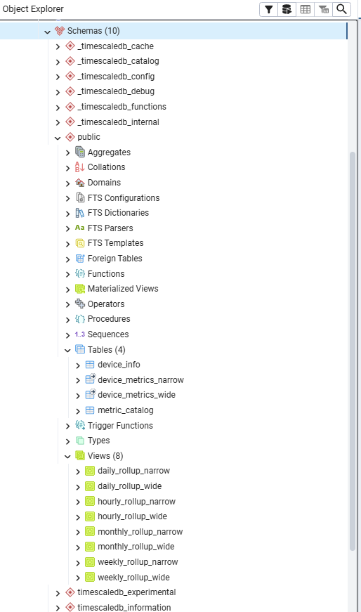

# TimescaleDB Module for Python Protocol Gateway

---

## Overview

The TimescaleDB module is a **transform / sink transport** for the Python Protocol Gateway.  
Its primary responsibility is to:

- Receive telemetry data from an upstream scraper transport (e.g. Modbus TCP connected inverter)
- Persist time-series data into a **TimescaleDB (PostgreSQL)** backend
- Detect **stale data conditions**
- Trigger **automatic upstream and downstream reconnects** when data stops flowing
- Enable downstream visualization and analytics via **Grafana**

The module does **not** scrape data itself. Instead, it acts as a consumer of bridged data streams and focuses on persistence, monitoring, and reliability.

---

## Architecture Overview

``` text
[ Inverter / Device ]
          |
          v
[ Modbus / TCP Transport ]
          |
          v
[ Protocol Gateway ]
          |
          v
[ TimescaleDB Transport ]
          |
          v
[ TimescaleDB (Postgres) ]
          |
          v
[ Grafana ]
```

---

## What the TimescaleDB Module Does

### Core Responsibilities

- Converts incoming measurements into normalized rows
- Writes data into hypertables optimized for time-series workloads
- Maintains metadata for scraped devices
- Detects stale data conditions
- Requests upstream reconnects when stale data persists
- Backlogs data during database outages and replays that data on database recovery
- Provide Grafana-ready metrics for visualization

### Stale Data Handling

The module tracks:

- Time since last successful write
- Number of reconnect attempts
- Retry backoff interval

When data becomes stale:

1. A reconnect is requested from the Protocol Gateway
2. The upstream scraper transport is reset and a reconnection is tried
3. Scraping resumes automatically if the device is reachable

---

## 4. Database Schemas

### 4.1 Narrow Table

One row per metric per timestamp.

| Column | Description |
| ------ | ------------ |
| m_time | Timestamp |
| device_info_id | Device identifier ID |
| metric | Metric name |
| value | Metric value |

#### Narrow Table Benefits

- Ideal for Grafana
- Flexible schema
- Efficient aggregation

### 4.2 Wide Table (If Less than 200 metrics chosen via the PPG variable filters)

One row per timestamp with multiple metric columns.

| Column | Description |
| ------ | ------------- |
| m_time | Timestamp |
| device_info_id | Device identifier ID |
| inverter_power | Example metric |
| grid_voltage | Example metric |
| panel_voltage | Example metric |
| etc. | etc. |

#### Wide Table Benefits

- Faster inserts
- Easier CSV/SQL exports

### 4.3 Device Info Table

| Column | Description |
| ------ | ------------- |
| device_info_id | Device Identifier ID |
| device_identifier | Device or Inverter Identifier ** |
| device_serial_number | Device or Inverter Serial Number ** |
| device_name | Device of Inverter Informal Name ** |
| device_manufacturer | Device or Inverter Manufacturer |
| device_model | Device or Inverter Model |
| device_firmware | Device or Inverter Firmware |
| device_location | Device or Inverter Location |
| transport | Device or Inverter Scraper Transport |

** =  Determines uniqueness of the Device.

### 4.4 Metric Catalog

| Column | Description |
| ------ | ------------- |
| id | Metric Unique ID |
| metric_name | Metric Name as shown in the PPG Registry |
| clean_column_name | Metric Name sanitized for SQL |
| data_type | Metric Data Type (default Double Precision) |
| created_at | Table Add Date |
| notes | metric name descriptions |

Here is a screen shot of how the schema looks in PGadmin.  The tables reside in the public folder.



---

## 5. Example SQL Queries

### 5.1 Power Over Time

```sql
SELECT
  time_bucket('1 minute', m_time) AS t,
  avg(metric_value) AS power
FROM public.device_metrics_narrow
WHERE metric_name = 'pload'
GROUP BY t
ORDER BY t;
```

### 5.2 Daily Energy Estimate

```sql
SELECT
  date_trunc('day', m_time) AS day,
  sum(metric_value) * 1/60 AS kwh
FROM public.device_metrics_narrow
WHERE metric_name = 'pload'
GROUP BY day
ORDER BY day;
```

### 5.3 Device Health (Last Seen)

```sql
SELECT
  device_info_id,
  max(m_time) AS last_seen
FROM device_metrics_narrow
GROUP BY device_info_id;
```

### 5.4 All metrics from public.device_metrics_wide

```sql
SELECT * FROM public.device_metrics_wide
ORDER BY m_time ASC, device_info_id ASC 
```

---

## 6. Docker Compose Installation

### 6.1 Images Used in the stack

- **TimescaleDB HA:** `timescaledb-ha:pg18`  The Timescale DB Application
- **Protocol Gateway:** `buxtoncalvin/pythonprotocolgateway:latest` The PPG application/inverter scraper
- **Grafana:** `grafana/grafana:latest`   The graphing application
- **PostGres Admin:** `dpage/pgadmin4:latest` The database administration application

### 6.2 Example docker-compose.yml

```yaml
version: "3.9"

services:
  timescaledb:
    image: timescale/timescaledb-ha:pg18
    environment:
      POSTGRES_PASSWORD: your-password
      POSTGRES_USER: your-user-name
      POSTGRES_DB: solar (or your database name)
    ports:
      # we change the access port here to allow for other postgres dbs
      - "5431:5432"
    volumes:
      - home/tsdb_data:/var/lib/postgresql/data
  
  # name your containers to whatever you want.  The TimescaleDB module sits on top of PPG
  18kPV_timescaledb:
    container_name: 18kPV_timescaledb
    image: buxtoncalvin/pythonprotocolgateway:latest
    restart: always
    security_opt:
      - apparmor:unconfined
    environment:
      - TZ=America/Los_Angeles
    volumes:
      - /home/ppg/cfg/config.cfg:/app/config.cfg
      - /home/ppg/cfg/variable_mask.txt:/app/variable_mask.txt
      - /home/ppg/cfg/variable_screen.txt:/app/variable_screen.txt
      - /home/ppg/cfg/eg4_18kpv.input_registry_map.csv:/app/protocols/eg4/eg4_18kpv.input_registry_map.csv
      - /home/ppg/cfg/eg4_18kpv.holding_registry_map.csv:/app/protocols/eg4/eg4_18kpv.holding_registry_map.csv
      - /home/ppg/cfg/eg4_18kpv.json:/app/protocols/eg4/eg4_18kpv.json
    logging:
    driver: "json-file"
    options:
      max-size: "10m" 
      max-file: "3"  

  grafana:
    container_name: grafana
    image: grafana/grafana:latest
    restart: always
    security_opt:
      - apparmor:unconfined
    ports:
      - 3000:3000
    env_file:
      - '/home/grafana/env.grafana'
    environment:
      - GF_AUTH_ANONYMOUS_ENABLED=true
      - GF_SECURITY_ALLOW_EMBEDDING=true
      - GF_DATABASE_USER=your-user-name
      - GF_DATABASE_PASSWORD=your-password
    user: '1000'    
    depends_on:
      - timescaledb
    volumes:
      - /home/grafana:/var/lib/grafana      

  postgres_admin:
    image: dpage/pgadmin4:latest 
    container_name: pgadmin
    restart: always
    security_opt:
      - apparmor:unconfined     
    environment:
    PGADMIN_DEFAULT_EMAIL: Blah@Gmail.Com
    PGADMIN_DEFAULT_USER: your-user-name
    PGADMIN_DEFAULT_PASSWORD: your-password
    PGADMIN_DISABLE_POSTFIX: true
    volumes:
      - /home/pgadmin:/var/lib/pgadmin
    ports:
      #  set the port to 8181 to avoid typical port 80 conflicts
      - "8181:80" 
    depends_on:
      - timescaledb     

```

---

## General configuration

### 6.3 Grafana Setup

```text

- Open Grafana: <http://localhost:3000>
- Login: admin / admin   or your username/password
- Add data source:
- Type: PostgreSQL
- Host: timescaledb:5431
- Database: metrics
- User: your-TSDB user-name
- Password: your-TSDB-password
- SSL: disabled
- Enable TimescaleDB option
- Create panels using SQL queries

```

### 6.4 PPG Configuration File General (config.cfg)

```ini
[general]
log_level = DEBUG
# enable for multi inverter reads.
enable_concurrency = false

[logging]
log_dir = logs
log_file = gateway.log
level = INFO
# weekly | daily | size
rotation = weekly         
# Monday rollover
when = W0                  
interval = 1
# keep 4 weeks
backup_count = 4           
# 100MB (only if size-based)
max_bytes = 104857600      
console = true
```

#### Example transport Scraper

```ini

[transport.modbus_tcp] 
log_level = DEBUG
transport = modbus_tcp
protocol_version = eg4_18kpv
analyze_protocol = false
write = false
host = 10.17.2.65
port = 502
#  Here you are telling PPG to use the timescaledb module for you data output.
bridge = transport.timescaledb
read_interval = 15
```

### 6.5 TimescaleDB Module Configuration (config.cfg)

#### Example timescaledb bridge configuration

```ini

[transport.timescaledb]
log_level = DEBUG
transport = timescaledb
host = 10.17.2.42
port = 5431
database = solar1
username =  your_user_name_here
password = your_password_here

# TimescaleDB Device settings.  Changing any of these three will create a new device in the database
device_name = 18KPV1
serial_number = 4066670076
device_identifier = Main Inverter

# Additional Device descriptors
manufacturer = EG4
model = 18kPV
device_firmware = 46543224
location = Basement

## All of the below are optional and are set to defaults if not specified
# force float coerces all values obtained to be of the float type
force_float = true

# persistent backlog settings
enable_persistent_storage = true
backlog_storage_path = timescaledb_backlog
backlog_file_name = no_connect_backlog

# max data points to store in backlog
max_backlog_size = 10000
# seconds-->  equal to 24 hours
max_backlog_age = 86400

# TSDB Connection monitoring settings
reconnect_attempts = 5
# minutes
reconnect_delay = 5
# Exponential backoff settings (reconnect delay increases exponentially on each failure)
use_exponential_backoff = true
# minutes --> 5 hours
max_reconnect_delay = 300

## hypertable and rollup options
# changing rollup settings after data has been written, will result in automatic view deletions and rebuilds
migrate_data = True
enable_compression = True
enable_rollups = True
# Seconds between rollup refreshes (6 hours)
auto_refresh_interval = 21600
enable_auto_refresh = True
drop_after = 1 year

# stale data cleanup settings minutes --> 5 hours
stale_data_timeout = 300

# pushover settings / leave blank and disable if you don't use pushover
enable_pushover = True
pushover_token = your_token_here
pushover_user = your_user_key_here
```

---

## Summary

The TimescaleDB module provides a production-grade ingestion and monitoring layer that integrates cleanly with the Python Protocol Gateway. It is designed to be predictable, observable, and resilient — pairing naturally with inverter telemetry, industrial sensors, and edge data collection workloads.

The TimescaleDB module provides:

- Reliable time-series persistence
- Automatic stale data detection
- Self-healing reconnect behavior
- Support for Grafana visualization
